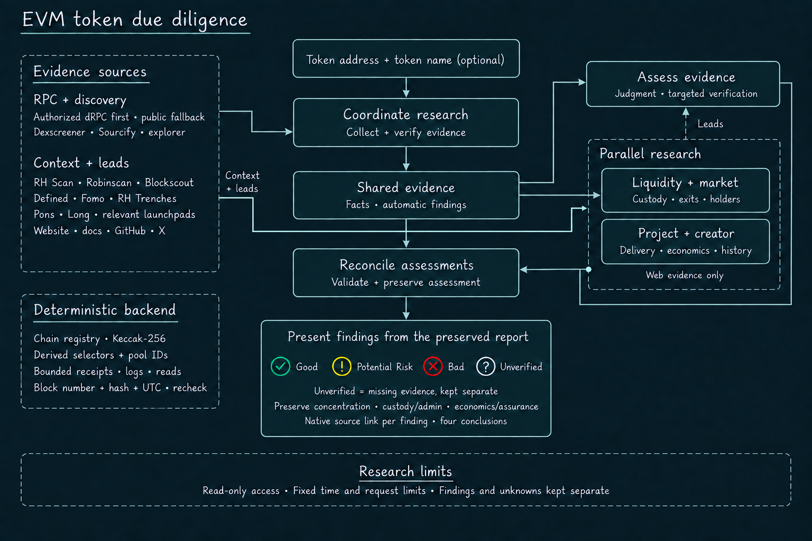

# Crypto research: token due-diligence skills

Evidence-bounded token due diligence for [Claude Code](https://claude.com/claude-code) and
[Codex](https://openai.com/codex). Give a skill an exact token address and it produces an
evidence-linked report in about 5 to 10 minutes, labeling every finding **Good**,
**Potential Risk**, **Bad** or **Unverified**, and never treating a gap as a pass.

This is research tooling, not financial advice. It never certifies a token as safe, and every
report says what it could not verify. Licensed under the [MIT License](LICENSE).

- **`crypto-evm-token-due-diligence`**: EVM tokens on any chain with a JSON-RPC endpoint,
  Robinhood Chain fully supported. Verifies the chain and pins every read to a block,
  matches deployed bytecode to published source, reads pools, reserves, quotes, balances,
  positions, the launch receipt and receipt-verified sales, reads the top holders with a
  contract check each, resolves owners and Safe signers, runs two web lanes for holders,
  trades, docs, creator history and promotion, then freezes a validated report.
- **`crypto-solana-token-due-diligence`**: exact Solana mints (SPL and Token-2022):
  controls, liquidity custody, exits, launch, supply, treasury and holder rights, with two
  bounded lanes and a frozen report.
- **`crypto-token-due-diligence`**: the lightweight entry point. Give it an address and your
  request; it classifies the address format and hands the whole request to the right
  specialist without duplicate research.

Current EVM versions: workflow 3.2.7, backend engine 3.4.2, reporting engine 2.6.2.
Python 3.10+ standard library only, no packages, no API keys.



**How to read the diagram.** You give a token address (and optionally a name). One
coordinator collects and verifies evidence: pinned RPC reads through your configured or
public endpoint plus Dexscreener, Sourcify and the chain explorer. That becomes *shared
evidence*: a facts file and a set of automatic findings the pipeline writes itself. Two web
research lanes run in parallel from that evidence, one for liquidity and market (custody,
exits, holders) and one for project and creator (delivery, economics, history), using web
sources only. The coordinator assesses the evidence, orders targeted verification where a
lead changes a conclusion, reconciles everything into one validated report, and presents
findings from that preserved report with four markers. Unverified means missing evidence
and is always kept separate from observed risk. The whole run is read-only, works inside
fixed time and request limits, and never treats a gap as a pass.

## Quick start

You need `git`, `python3` (3.10 or newer) and Claude Code or Codex. Nothing else.

**Option A, one command (recommended).** Clone once, then link the skills into your user
account so they work in every project:

```sh
git clone <repository URL> ~/crypto-research
cd ~/crypto-research
./install.sh
```

The script creates symlinks under `~/.claude/skills/` and `~/.claude/agents/` (Claude Code)
and `~/.agents/skills/` (Codex). It never overwrites something that is already there. Use
`./install.sh --copy` if your tool cannot follow symlinks, and `./install.sh --uninstall` to
remove the links. To update later, `git pull` in the clone; linked installs pick the change
up immediately, copied installs need `./install.sh --copy` again.

**Option B, no install.** Clone and start Claude Code or Codex *inside* the folder. Claude
Code discovers the EVM skill and its lane subagents from `.claude/`; Codex discovers the EVM
skill from `.agents/skills/`. The other two skills need Option A. Research output lands in
the ignored `research/` folder.

Confirm the install by starting a new session and typing `/skills` in Claude Code, or `$`
followed by `crypto` in Codex, and looking for the skill names.

### Set an RPC endpoint

The EVM skill reads the chain through a JSON-RPC endpoint you provide. Copy the example
file outside the repo and edit it:

```sh
mkdir -p ~/.config/crypto-research
cp env.example ~/.config/crypto-research/env
chmod 600 ~/.config/crypto-research/env
```

The example points at the free public endpoint for Robinhood Chain mainnet (chain 4663).
For another chain, put any HTTPS JSON-RPC endpoint for it in `ROBINHOOD_DRPC_URL` (or name
another variable with `--rpc-url-env`); the skill verifies `eth_chainId` before trusting it.
The Solana skill uses the public mainnet endpoint unless you set `SOLANA_RPC_URL`, and a dRPC
endpoint (`SOLANA_DRPC_URL`, credential-free, plus the shared `DRPC_API_KEY`) when a run
authorizes paid use. A paid provider (for example dRPC) is optional and is used
only when you configure it and authorize it; personal standing authorizations belong in an
untracked `HANDOFF.local.md` next to `HANDOFF.md`, whose generic policy is what the skill
reads otherwise. The first research call may ask your tool for network permission; grant it
for that command. A public endpoint may rate-limit a run of about 200 to 300 reads; the
collector retries transient failures once and records anything still missing as a gap.

### Run a due diligence

Give the skill an exact contract address. The chain can be inferred when discovery is
unambiguous (Robinhood Chain in particular); otherwise name it.

Claude Code:

```text
/crypto-evm-token-due-diligence Broad diligence on chain 4663, token 0x39dBED3a2bd333467115dE45665cC57F813C4571. General diligence, no special requirements.
```

Codex:

```text
$crypto-evm-token-due-diligence Broad diligence on chain 4663, token 0x39dBED3a2bd333467115dE45665cC57F813C4571. General diligence, no special requirements.
```

Not sure of the network? Use the entry point with the same words:
`/crypto-token-due-diligence <address> <your request>`.

State real requirements when you have them, for example "I need to exit 50,000 tokens" or
"I require locked liquidity"; the report then evaluates those conditions explicitly instead
of assuming them. Extra asks and links travel with the run: "dig into the lore behind this
coin and whether it is real, see https://x.com/<account>/status/<id>" reaches both research
lanes, which capture the link first and answer the ask in a finding or a coverage entry.
Focused questions work too: "did the treasury's WETH come from LP fees?" runs the
collection without the web lanes and answers from the facts.

What comes back, in roughly 5 to 10 minutes:

- **A chat answer** with a direct conditional verdict, 4 to 8 findings labeled ✅ Good,
  🟡 Potential Risk or 🔴 Bad with links into the evidence, a separate ⚪ Unverified list
  of what could not be established, and a **Conclusions** block of four bullets: technical
  exposure, credibility and maturity, token economics, research confidence.
- **A frozen report** at `research/<token>-<timestamp>/report/report.md` with every finding
  tied to raw evidence (pinned RPC responses, receipts, captured pages), all eleven risk
  surfaces rated, coverage limits and a validation record. Nothing in it is an opinion
  without a source.

Things the skills refuse to do: certify a token as safe, predict price, sign or broadcast
transactions, use your keys, or turn a missing source into a passing check.

### How an EVM run works

1. **Collect.** One process discovers pools and links (Dexscreener), fetches published
   source (Sourcify) and the explorer's creation transaction, holders, transfers and counters,
   then runs four pinned RPC phases: token controls and proxy slots, pools with reserves and
   balances, quotes and positions and owners, and code for every actor the receipts name.
   It writes `facts.json` and composes the **pipeline note**: factual findings straight from
   the evidence (matched source, decoded launch, custodian and Safe signers, pool depth and
   quotes, receipt-verified sales, holder distribution, admin owners, dependencies, maturity).
2. **Research in parallel.** Two lanes each receive a self-contained brief and four minutes:
   liquidity and market (position custody, holder table, sells, adoption, promotion) and
   project and creator (official channels, repositories, audits, creator fee flows, prior
   launches). They capture pages with provenance and return one validated note each.
3. **Verify what matters.** The coordinator orders at most two targeted collections for
   conclusion-changing leads, for example a sale receipt a lane found or a locker's owner.
4. **Reconcile and present.** The coordinator assigns a topic and signal to each pipeline
   finding, adds its own adverse findings and coverage judgements, and `finalize` composes,
   validates, freezes and delivers the report in one step. The chat answer is written from
   the frozen report, never from memory.

### Notes and limits

- Explorer access varies. Blockscout's API answers the bundled fetcher; RH Scan and
  Robinscan render as JavaScript shells and are recorded as gaps. Pinned RPC reads,
  Dexscreener and Sourcify carry the evidence either way.
- Uniswap v4 pools have no read-only quoter on Robinhood Chain, so exit depth for v4-only
  tokens is evidenced by receipt-verified sales rather than three-size quotes.
- A token with no published source is reported as a Potential Risk on controls even when
  every probed getter looks harmless; bytecode observations are not a substitute for source.
- Every run is a fresh investigation. Old runs in `research/` are never reused as evidence.
- Validation proves the report is internally consistent and evidence-bound. It does not
  prove a token is safe or a project honest.

### Verify the helpers

```sh
PYTHONDONTWRITEBYTECODE=1 python3 -m unittest discover -s skills/crypto-token-due-diligence/tests -q
PYTHONDONTWRITEBYTECODE=1 python3 -m unittest discover -s skills/crypto-evm-token-due-diligence/tests -q
PYTHONDONTWRITEBYTECODE=1 python3 -m unittest discover -s skills/crypto-solana-token-due-diligence/tests -q
```

All three suites are offline and take well under a minute together; expect `OK` from each.

---

## Development notes

Everything below is for people changing the skills: layout, regression suites, the review
records behind each version, provider configuration and history. Friends installing the
skills do not need it.

This repository is the editable home of the token-diligence router and EVM/Solana specialist
skills, their Python helpers, regression tests, development plans, and saved synthetic evidence.

### Layout

| Path | Contents |
| --- | --- |
| [skills/crypto-token-due-diligence](skills/crypto-token-due-diligence/SKILL.md) | Lightweight offline entry point: classify candidate address format and continue with the EVM or Solana specialist. |
| [skills/crypto-evm-token-due-diligence](skills/crypto-evm-token-due-diligence/SKILL.md) | Token diligence, deterministic RPC collection, SQLite caching, JSON evidence, launch-recipient and fee checks, and regression tests. |
| [skills/crypto-solana-token-due-diligence](skills/crypto-solana-token-due-diligence/SKILL.md) | Standalone Solana controls, pool/position custody, bounded execution/creator evidence, two-lane research and frozen report replay (v2 default). |
| [.agents/skills/crypto-evm-token-due-diligence](.agents/skills/crypto-evm-token-due-diligence/SKILL.md) | Codex project registration: a relative symlink to the canonical EVM folder, not a second editable copy. |
| [.claude/skills/crypto-evm-token-due-diligence](.claude/skills/crypto-evm-token-due-diligence/SKILL.md) | Claude Code project-skill copy of the EVM diligence skill; same checks, helpers and versions with Claude Code tool wording. See its [port notes](.claude/skills/crypto-evm-token-due-diligence/CLAUDE-CODE-PORT.md). |
| [plans](plans/project-migration.md) | Original conversion plan and project migration record. |
| `history/` (archive branch only) | Prior baselines, reviewed releases, implementation records, synthetic collections, caches and replays; kept on the maintainer's local `archive/pre-publish` branch, not in the published tree. |
| [HANDOFF.md](HANDOFF.md) | Current provider setup, standing bounded-use authorization, and a starter prompt for a new chat. |

#### Why the EVM skill appears in two folders

**Edit `skills/crypto-evm-token-due-diligence/`.** This is the canonical folder
containing the actual files, alongside the other two editable skills under `skills/`.
The entry at `.agents/skills/crypto-evm-token-due-diligence` is a **symlink**
(a filesystem shortcut), not another copy:

```text
.agents/skills/crypto-evm-token-due-diligence
  → ../../skills/crypto-evm-token-due-diligence
```

Codex discovers the skill through the project-local `.agents/skills/` entry and
reads the same files stored under `skills/`. A file browser may expand both paths
as folders, but editing through either path changes the same underlying files;
there is nothing to synchronize between them.

We keep this layout so Codex can discover the skill while developers have one
consistent home for all three canonical skills. Preserve the symlink: do not replace
it with a copied folder. The `.claude/skills/` entry is different—it is an actual
Claude Code copy maintained using the port notes linked above.

EVM diligence is registered only in this project. Its former Personal symlink was
removed; the other two skills retain their `~/.codex/skills/` symlinks to this repo.
The EVM skill still locates this checkout's provider policy and sources the documented
private env file; registration scope does not move credentials or remove dRPC access.
See the [task/path audit and verification](plans/evm-registration-audit-2026-09-08.md).
Original work and plan paths also link to their relocated contents to preserve
saved evidence references. Codex supports linked skill folders; see the
[official skill documentation](https://learn.chatgpt.com/docs/build-skills#where-codex-loads-local-skills).

### Run the regression suites

From this project directory, with Python 3.10 or later:

```sh
PYTHONDONTWRITEBYTECODE=1 python3 -m unittest discover -s skills/crypto-token-due-diligence/tests -q
PYTHONDONTWRITEBYTECODE=1 python3 -m unittest discover -s skills/crypto-evm-token-due-diligence/tests -q
PYTHONDONTWRITEBYTECODE=1 python3 -m unittest discover -s skills/crypto-solana-token-due-diligence/tests -q
```

The helpers and tests use the Python standard library. The current EVM backend engine is
3.4.2, workflow is 3.2.7 and reporting engine is 2.6.2 (availability response schema 2;
evidence/cache schema 1, investigation schema 3, strict report profile `evm-evidence-v2`).

The [network execution update](plans/evm-network-execution-2026-09-11.md) makes the first
collector and lane capture invocation account for declared host network restrictions.
It requests per-command permission where supported, without changing global permissions
or treating collector authorization flags as network access.

The [production review](plans/evm-production-review-2026-09-11.md) adds regression-tested
request accounting, receipt matching, missing-data handling and checkpoint repairs inside
the existing workflow, with no additional research calls or turns.

The [performance optimization](plans/evm-performance-optimization-2026-09-10.md) targets a
completed ordinary broad EVM review in 5–7 minutes (10 cap). Measured baselines showed RPC
network time near 25 seconds per run while model turns, lane message traffic, per-fetch
budget charging and a bespoke assembly script written in every run consumed the rest.
Workflow 3.0.0 replaces those with `broad_collect.py` (one-process discovery, four pinned
RPC phases, source match, `facts.json`), `bundle_assemble.py compose`/`finalize` (compact
notes expanded into the strict report), bundled Keccak and presets, `web_capture.py`, two
brief-driven lanes with a 4-minute cutoff, and a phase timeline in the session ledger.
The standard scope defined in the completion reference is what a completed ordinary review
means; deeper work needs a named conclusion-changing trigger. The first live acceptance run
delivered a completed PONS report in 10.0 minutes (baselines 18.9 and 45.1); see the
[live results](plans/evm-performance-optimization-2026-09-10/live-results.md). See its [backend guide](skills/crypto-evm-token-due-diligence/references/deterministic-backend.md)
and [improvement workflow](skills/crypto-evm-token-due-diligence/references/improvement-loop.md)
for collection, replay, evidence-linked feedback, and versioned changes.

The [efficient-completion repair](plans/evm-efficient-completion-2026-09-10.md) targets
10–15 minutes for ordinary broad EVM research including the report. Critical access and
source checks start early, lane handoffs feed the draft incrementally, and a read-only
preflight catches multiple reference errors together. Completed reports no longer require
follow-up homework: decision review 2 allows zero actions and rejects deferred research.
Source comparison 1.1.0 supports unchanged unreachable literal tails before metadata,
while preserving strict byte/jump checks and versioned historical replay. The review record
separates measured prior-run delays and offline recoveries from unproven live speed claims.

The [budget-continuation repair](plans/evm-budget-continuation-2026-09-10.md) separates
operational estimates from finite run ceilings. A reviewed plan covers all eleven
surfaces plus collection overhead; explicit same-session replanning preserves consumed
attempts, reservations, cache identity and ceiling provenance. It cannot expand the
ceilings or grant spending permission. New completed reports must also pass `deliver`;
a valid saved checkpoint remains internal progress and cannot serve as ordinary final
delivery. This repairs the premature stopping path left by the earlier completion gate.
Real evidence/access limits stay explicit. Historical ledgers and reports are unchanged.

The earlier [completion-quality update](plans/evm-completion-quality-2026-09-10.md) makes
standalone broad EVM diligence completion-driven. The old 5–10-minute cutoff is now a
progress checkpoint; plan enough operational time for consequential follow-up while
retaining a finite shared request cap. Final freezes reject unfinished required work;
`--checkpoint` explicitly preserves an interruption. Completed reviews can retain
specific, evidenced external research limits without converting unknowns to passes.
This changes broad EVM delivery, not rapid rug-screen limits or spending authorization.

The [decision-quality review](plans/evm-decision-quality-2026-09-09.md) repairs the gap
between neutral evidence labels and an unsupported negative headline. New freezes bind
verdict types, explicit user requirements, four-axis synthesis and one to three actions
to findings and coverage. Unknowns can prompt investigation; adverse recommendations need
adverse evidence. Public team/operating history receive a bounded credibility assessment,
and ordinary discretionary economics are not automatically defects. The report shows
these conclusions before technical detail and the chat must preserve their strength.
This is calibration in both directions, not a promise of positive reports or proven live
classification accuracy. Frozen historical output remains unchanged.

The [assessment calibration update](plans/evm-assessment-calibration-2026-09-09.md)
separates **⚪ Unverified** research gaps from **✅ Good / 🟡 Potential Risk / 🔴 Bad**
assessed findings. Broad EVM diligence now includes bounded adoption/maturity and token
economics context alongside technical exposure and research confidence. Valuation and
popularity never override adverse authority; missing access/history never becomes a
risk penalty or a passing check. The eleven dimensions are unchanged; the current broad EVM completion policy above
supersedes this release's original timing policy. Existing frozen reports retain their original engines and evidence.

The [stopping-review update](plans/evm-stopping-review-2026-09-09.md) requires new
EVM freezes to explain each incomplete surface: decision impact, captured attempts,
the next useful route and the actual stopping boundary. Pending follow-up and untouched
intake placeholders fail validation. Critical gaps remain visible. Under the current completion policy, a budget
cutoff is an unfinished checkpoint, not a completed broad report. Finite request limits still apply.

The [supported EVM flow](skills/crypto-evm-token-due-diligence/references/supported-research-flow.md)
creates intake drafts, one shared investigation session, verified bootstrap packets,
source comparisons and frozen reports. Every live collector/bootstrap/source lookup
requires the same `--session`; subsequent commands cannot reset its usage or ceilings.
Operational allowances can be revised only through the explicit reviewed replanning path.
The offline provider check remains unchanged. Exact pinned cache reuse stays inside
that fresh investigation. New reports use strict subjects/support, derived dependencies,
execution effects, per-surface coverage and safe evidence links; old reports explicitly
select `legacy-v1`. Reporting snapshots preserve offline replay across upgrades.

[Operational memory](skills/crypto-evm-token-due-diligence/memories.md) separates bounded
run observations from reviewed guidance and token state. Maintenance ingests recurrence
in a separate database and promotes only demonstrated recoveries with review hashes,
version scope and expiry. The initial lessons are retired into maintained code/references.
The [implementation record](plans/evm-skill-audit-2026-09-08/implementation.md) reconciles
the audit acceptance checks. Synthetic scheduling measured rolling 0.099509 s versus
waves 0.181871 s at the same 11 attempts; no live speed or accuracy claim is made.

Historical changes follow for provenance. EVM workflow 1.3.0 added explicit [source priorities and parallel lanes](skills/crypto-evm-token-due-diligence/references/source-routing-and-execution.md),
v2 LP custody, vesting/dilution and delegated-account checks. Matching configured authorized
dRPC remains first; the coordinator owns provider fallback, pins and the shared budget.
Backend 2.1.0 adds bounded concurrent reads, deadline controls and final-pin request
reservation. Reporting 1.1.1 rejects mismatched/malformed RPC results and conflicting pins.
The [comprehensive review](plans/evm-comprehensive-review-2026-09-06.md) records findings,
regressions and limits. These changes do not constitute a live accuracy or latency benchmark.

EVM workflow 1.4.2 makes every invocation a fresh investigation: a new workspace, cache
file, pins, collection and web reads each time, never reusing earlier `research/` run
output as evidence. See [the fresh-investigation record](plans/evm-fresh-investigation-2026-09-07.md).

EVM workflow 1.4.1 lets `provider_context.py` locate trusted project context from a
`.claude/skills/` layout as well as `skills/`, sharpens the skill description, and adds the
Claude Code copy described above. See [the port record](plans/evm-claude-code-port-2026-09-06.md).

EVM workflow 1.4.0 extends that source routing with Pump.fun social trading and explicit
Pons/Long launchpad discovery. Exact-token identity, version-matched launch evidence and
shared source ownership bound the added work; inaccessible feeds remain coverage gaps.
The backend and reporting versions above are unchanged. See the
[source update and diagram review](plans/evm-social-and-launchpad-sources-2026-09-07.md).

EVM diligence workflow 1.2.0 adds concise **Good / Potential Risk / Bad** findings for
token/liquidity, real work versus marketing, creator trading/proceeds and prior launches.
Unknowns remain explicitly labeled; evidence-backed positives never certify safety.
Reporting engine 1.1.0 places a validated finding-linked summary above the complete
eleven-dimension evidence report. Legacy bundles without summaries render unchanged;
the RPC backend and research rubric are unchanged. See the
[reporting rules](skills/crypto-evm-token-due-diligence/references/evidence-and-output.md)
and [synthetic examples](skills/crypto-evm-token-due-diligence/references/reporting-scenarios.md).

EVM workflow 1.4.3 and reporting 1.1.2 display ✅ Good, 🟡 Potential Risk and 🔴 Bad
in chat and generated summaries. Machine signal values and evidence gates remain unchanged.
See the [marker update review](plans/evm-finding-markers-2026-09-08.md).

EVM workflow 1.5.0 adds [RH Trenches tracked-wallet activity](skills/crypto-evm-token-due-diligence/references/platforms.md#rh-trenches-tracked-wallet-activity)
as supplementary Robinhood Chain evidence. Full contract matching, selective-history
limits, estimated values and persona attribution are explicit; material trades still
use the existing dRPC-first verification and shared budget. See the
[source integration and diagram review](plans/evm-rh-trenches-sources-2026-09-08.md).

EVM workflow 1.6.0 adds [RH Scan explorer guidance](skills/crypto-evm-token-due-diligence/references/platforms.md#rh-scan-explorer)
for Robinhood mainnet contract, holder and history discovery. Loading placeholders,
index/export limits, proxy-source badges, labels and sequencer confirmation remain
bounded evidence; dRPC-first verification and private-env access are preserved.
See the [source and diagram review](plans/evm-rh-scan-sources-2026-09-08.md).

EVM workflow 1.7.0 adds [Robinscan explorer guidance](skills/crypto-evm-token-due-diligence/references/platforms.md#robinscan-explorer)
alongside RH Scan within the shared source budget. It bounds holder samples, index
coverage, source/trace and batch records; distinguishes Fomo's cross-chain leaderboard
from Robinscan's capped wallet PnL; and keeps partner API/MCP access optional.
The canonical and Claude Code copies retain the existing dRPC/private-env policy.
See the [Robinscan source and diagram review](plans/evm-robinscan-sources-2026-09-08.md).
The [main dark architecture PNG](docs/diagrams/evm-diligence-architecture-dark.png)
is a presentation-level view of workflow 3.2.5, backend 3.4.2 and reporting 2.6.2.
It highlights evidence collection, parallel research, reconciliation and preserved findings;
execution details remain in the skill and runbook. See the
[current diagram review and generation prompt](docs/diagrams/evm-diligence-architecture-v10.prompts.md).
Superseded diagram files were removed; this is the single maintained diagram.

The [delivery consistency repair](plans/evm-delivery-consistency-2026-09-11.md) adds exact holder aggregation and preserves material findings during chat compression inside the existing calls; request budgets and research turns are unchanged.

The [citation presentation update](plans/evm-citation-presentation-2026-09-11.md) puts adjacent native source links on each chat finding, allowing client-rendered company/product icons without emoji substitutes, reusing the existing report read with no added research calls or agent turns.

### Research timing and browser behavior

Standalone broad `$crypto-evm-token-due-diligence` uses the completion policy above.
Target a completed report in 5–7 minutes (10 cap) through the standard pipeline; a run past
the cap states its conclusion-changing trigger or saves an internal checkpoint. Feasible
required work cannot become a final homework list.

Use `$crypto-token-due-diligence` as the single token entry point. It preserves the
entire request and selects the EVM or Solana specialist from candidate address format.
`0x` plus 40 hex characters suggests EVM; a valid 32-byte base58 public key suggests
Solana unless explicit chain context conflicts. Other formats never default to Solana.
The specialist verifies chain and token identity; the router does no network research.

One original clock covers routing and diligence: aim for 5–7 minutes total, with the
ordinary 10-minute stopping rule and any shorter user limit preserved. Straightforward
EVM routing needs no helper call; optional local validation has no network overhead.
End-to-end model/tool latency is not guaranteed by local benchmarks. Native assets,
market-wide analysis and the former scoring workflow are outside this router.

The old `crypto-research` skill and Personal registration are retired. Its exact final
[rubric snapshot](plans/retired-crypto-research-rubric-2026-09-11.md) is preserved as
provenance, alongside frozen history and Git; it is not an active dependency. The new
router retains a Personal symlink to its canonical folder, while EVM remains project-only.
See the [implementation and review record](plans/token-diligence-router-2026-09-11.md).

All three workflows prefer background web/API access and hidden in-app browsing when
needed. They do not create personal Chrome tabs, groups or pins by default. Start with
Sol Medium for research and Astra High for explicitly deeper work. These are
recommendations; skills do not switch the selected model.
Live end-to-end latency and detection accuracy have not been benchmarked.

Historical engine versions and evidence snapshots remain frozen, including those
from the retired rug-check skill.

### Solana support and routing

Keep `crypto-evm-token-due-diligence` for EVM questions and use the new
`crypto-solana-token-due-diligence` for exact Solana mints. Whole-token research selects
a candidate specialist, which then verifies identity. See [routing](skills/crypto-token-due-diligence/SKILL.md).
Address shape, ticker or a brokerage listing alone does not verify the chain.

Solana reads use `SOLANA_RPC_URL`, not the configured EVM endpoint. Solana defaults to available public RPC/explorer/API sources;
no dRPC connection, key or persistent configuration is required. A public endpoint can
be supplied temporarily to the collector. The EVM path honors a configured, authorized
provider; the Solana path is public-only, reads no policy file and needs no setup prompts. Native SOL research is distinct from WSOL/LST tokens.

Solana v2 workflow/reporting **2.0.0** is the default after functional acceptance.
The [runbook](skills/crypto-solana-token-due-diligence/references/runbook.md) integrates
one original session, two bounded research lanes, typed facts, at most two follow-up
presets, note composition and immutable readable delivery/replay. Public RPC uses a
standalone standard-library transport; custom Solana dRPC is deferred. Use explicit `--profile legacy-v1` for old bundles; their evidence and rendering
remain unchanged. The three original public live cases were partial checkpoints; the
2026-09-11 review traced that to a public-endpoint transport defect and fixed it. See
[review fixes](plans/solana-review-fixes-2026-09-11.md) for the live evidence, alongside the
original [acceptance](plans/solana-evm-parity-2026-09-11/acceptance.md) and
[live measurements](plans/solana-evm-parity-2026-09-11/live-results.md).

Supported typed product families are Raydium CPMM, AMM v4, CLMM; Orca Whirlpool;
Meteora DLMM, DAMM v2; and Pump curve/PumpSwap. Capability limits are product-specific:
unknown layouts/ranges/controller paths stay unresolved; source publication does not
prove the deployed build. Exact integer holder aggregates, sampled LP/position custody,
known upgrades/delegates, bounded historical receipts/creator flows and scoped quotes
preserve their actual dependencies. A receipt or quote is not a present safety guarantee.

Finalized contexts are not EVM historical-state pins. Broad completion requires all
eleven standard surfaces, both checked lanes and meaningful independent conclusions.
Partial work remains a checkpoint. The frozen report carries full evidence, collector/
reporting/adapter code and registry/layout hashes; hash-only verification never executes
bundled code, while isolated replay requires explicit trust. Operational feedback is
bounded, nonblocking and separately reviewed; no active lessons are installed.

All three unittest suites above remain mandatory. Current implementation checks:
Solana **417**, router **30**, EVM **429** are the current suite counts (Solana grew with the 2026-09-11 review fixes, the 2026-09-12 delivery work and review, and the dRPC/custody/curve round),
including independent outcome, live-regression, legacy and default-dispatch tests. See [implementation](plans/solana-evm-parity-2026-09-11/implementation.md)
and [evidence tools](skills/crypto-solana-token-due-diligence/references/evidence-and-tools.md).
Targets are seven-minute ordinary research and ten-minute handling, with two minutes
reserved for delivery; live latency and research parity are not yet claimed.

### Optional dRPC configuration

Before the first provider check or RPC attempt, read the **current policy at the top of
[HANDOFF.md](HANDOFF.md)**. It records this user's standing bounded paid read-only dRPC
authorization and matching network. Prefer that configured authorized endpoint for
Robinhood mainnet before public RPC. Installed EVM skill invocations run
`provider_context.py` to locate these files even from a different working directory.
Personal authorization stays in project context, outside the portable skill.

Research works without dRPC. A genuinely missing key, endpoint or authorization, or a
failed provider request, hands research back to authorized alternatives. An omitted
invocation flag first requires context review; it is not evidence of provider failure.
Research now invokes EVM diligence for verified EVM tokens (including Robinhood Chain)
and Solana diligence for verified Solana mints. Native assets do not acquire invented
contracts/mints; other non-EVM chains have explicit unsupported specialized coverage.

If configuring dRPC later, keep personal exports in `~/.config/crypto-research/env`, outside
this shareable project, with file permissions `600`:

```sh
export ROBINHOOD_DRPC_URL='https://lb.drpc.live/robinhood'   # the network URL only, never the key
export SOLANA_DRPC_URL='https://lb.drpc.org/solana'          # optional; this is the default when unset
export DRPC_API_KEY='YOUR_API_KEY'                           # the only place the key goes
```

Both skills send the key as a `Drpc-Key` header and refuse a URL that carries it (a `dkey`
parameter or a key path segment) with the reason `rpc_url_carries_credential`.

Source that file in the **same shell invocation** as each collector command, with shell
tracing disabled (`set +x`). The collector reads environment variables; it does not
automatically load `.env` files. Exports in another Terminal or earlier tool call do not
persist into a new invocation. Never display the private file or environment values.
Configuring a key alone does not approve paid usage; honor existing user authorization
recorded in the current project context. For this user's already-authorized configuration, use the complete check:

```sh
set +x
if [ -r "$HOME/.config/crypto-research/env" ]; then
  source "$HOME/.config/crypto-research/env" >/dev/null 2>&1 || exit 2
fi
python3 skills/crypto-evm-token-due-diligence/scripts/rpc_collect.py \
  --check-availability --provider drpc \
  --allow-network --cost-policy paid --allow-paid
```

Availability schema 2 reports `invocation_required / review_invocation_context` for
omitted flags, `fallback / continue_standard_flow` for configuration gaps, and
`ready / run_collector` for a valid authorized invocation. All are offline, zero-request
results with `provider_tested: false`. Read `blocking_reasons`; honor saved permission
when present and continue authorized alternatives if permission is actually absent.
During research, ready must be followed by a bounded collection, not a blocked-identity
answer. The [backend guide](skills/crypto-evm-token-due-diligence/references/deterministic-backend.md)
documents live collection, attempt budgets and evidence requirements. These personal
approval instructions do not apply to friends sharing the portable skills.

### Sharing with friends

This repository is published as is; the Quick start above is the friend-facing path
(`git clone`, `./install.sh`, `env.example`). Nothing personal ships in git: the provider
policy in `HANDOFF.md` is generic and credential-free, personal standing authorizations
live in the untracked `HANDOFF.local.md`, credentials stay in `~/.config/crypto-research/env`,
and research output, caches and local tool settings are ignored. The development provenance
folder `history/` is not published; it lives on the maintainer's local `archive/pre-publish` branch. The earlier sanitized
export route in [sharing/SHARING.md](sharing/SHARING.md) is superseded and kept as history.

### Continuing development

Use an implement, review, improve cycle with regression tests for demonstrated changes.
Preserve archived research-rubric provenance, verified EVM/Solana routing, and the no-key fallback.
Keep frozen evidence and engine snapshots unchanged; write new outputs to new directories.
The project is registered and pinned in Codex. Git was initialized on `main` for the
user-requested initial snapshot of the skills and development history. No remote has
been configured and nothing has been pushed. Future commits/pushes require a new request.