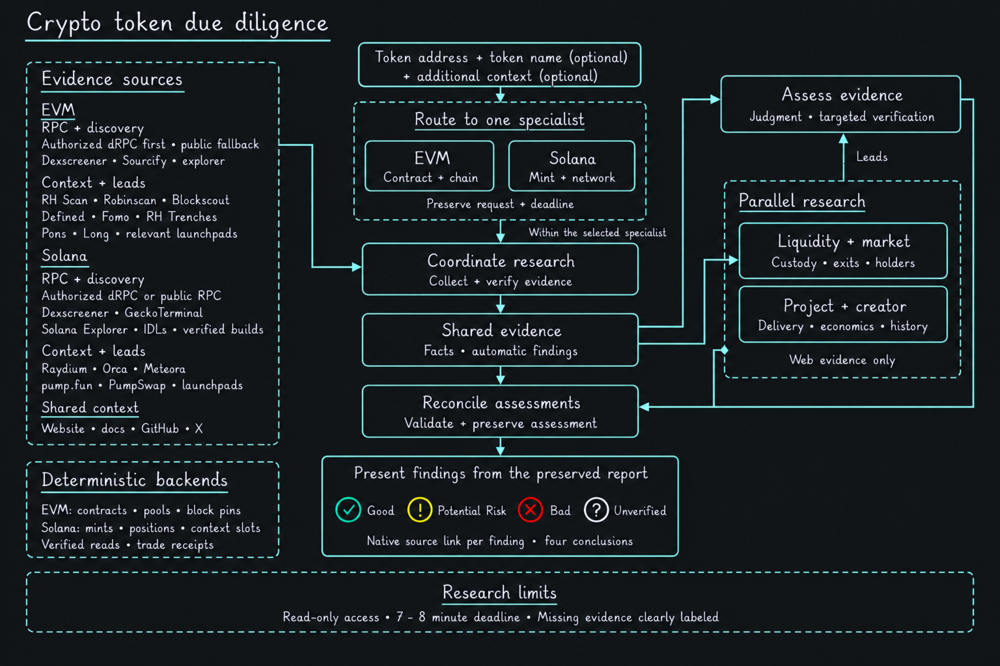

# Crypto research

Token due-diligence skills for [Claude Code](https://claude.com/claude-code),
[Codex](https://openai.com/codex) and [Cursor](https://cursor.com). Provide an exact EVM token address or Solana mint,
an optional token name, and any questions or context. Get a source-linked assessment
of token controls, liquidity, project credibility, creator history and token economics.

Reports label findings **Good**, **Potential Risk**, **Bad** or **Unverified**, explain
what could not be verified, and save the supporting evidence under `research/`.
Research is read-only: no wallet connection, signing or trading.

## Skills

| Skill | Purpose |
| --- | --- |
| [crypto-token-due-diligence](skills/crypto-token-due-diligence/SKILL.md) | Start here. Routes your request to the appropriate specialist. |
| [crypto-evm-token-due-diligence](skills/crypto-evm-token-due-diligence/SKILL.md) | EVM token research, including Robinhood Chain. |
| [crypto-solana-token-due-diligence](skills/crypto-solana-token-due-diligence/SKILL.md) | Solana mint research for SPL and Token-2022 tokens. |
| [deep-plan](skills/deep-plan/SKILL.md) | General workflow skill: interviews you about an idea and saves a phased plan. |
| [implement-review-improve](skills/implement-review-improve/SKILL.md) | General workflow skill: implements one plan phase, reviews it, fixes and verifies. |

All five skills work in Claude Code, Codex and Cursor from one shared copy. The two
workflow skills run only when you invoke them by name.

## Quick start

Requires **Python 3.10+**, **Git**, and **Claude Code, Codex or Cursor**. No Python packages required.

```sh
git clone <repository URL> ~/crypto-research
cd ~/crypto-research
./install.sh
```

The installer links the skills into your user account and leaves existing files alone.
Start a new session after installation. Use `./install.sh --copy` if symlinks are
unavailable, or `./install.sh --uninstall` to remove installed links.
Linked installs pick up updates when you run `git pull` in the clone.

## Usage

In **Codex**:

```text
$crypto-token-due-diligence Research <TOKEN_ADDRESS>. Focus on liquidity, creator history, and whether the project has delivered what it claims.
```

In **Claude Code** or **Cursor**, use `/crypto-token-due-diligence` with the same request.
You can also invoke either specialist directly. Include the network when known,
relevant links, and any specific requirements—for example, “Can I exit 50,000 tokens?”

You receive a concise assessment with evidence links, clearly labeled research gaps,
and a saved report. Public data availability affects coverage; a positive finding is
not a guarantee that a token is safe.

## Set an RPC endpoint

**Solana works with public mainnet RPC by default.** For EVM, copy the configuration
example outside the repository and edit it:

```sh
mkdir -p ~/.config/crypto-research
cp env.example ~/.config/crypto-research/env
chmod 600 ~/.config/crypto-research/env
```

The example uses Robinhood Chain's public endpoint. Set `ROBINHOOD_DRPC_URL` to the
HTTPS RPC endpoint for your EVM chain. `SOLANA_RPC_URL` optionally overrides Solana's
public endpoint.

**Optional dRPC:** add the following to that private env file, using your own key:

```sh
export ROBINHOOD_DRPC_URL='https://lb.drpc.org/robinhood'
export SOLANA_DRPC_URL='https://lb.drpc.org/solana'
export DRPC_API_KEY='your-key'
```

Keep keys out of URLs and the repository. Paid access requires your authorization;
a configured key alone does not permit spending. Public RPC requires no API key.
See [provider setup](HANDOFF.md) and the
[Solana runbook](skills/crypto-solana-token-due-diligence/references/runbook.md) for details.

## Architecture

The router selects one specialist, which collects evidence, runs two research lanes,
and reconciles the findings into a preserved report.

[](docs/diagrams/crypto-token-diligence-architecture-dark.png)

Individual diagrams: [EVM](docs/diagrams/evm-diligence-architecture-dark.png) ·
[Solana](docs/diagrams/solana-diligence-architecture-dark.png).

## Development

Editable skills live under `skills/`. Follow [project guidance](AGENTS.md) and the
[EVM port notes](.claude/skills/crypto-evm-token-due-diligence/CLAUDE-CODE-PORT.md)
when changing them. Implementation and review records are in [plans/](plans/).

Run the offline regression suites from the repository root:

```sh
PYTHONDONTWRITEBYTECODE=1 python3 -m unittest discover -s skills/crypto-token-due-diligence/tests -q
PYTHONDONTWRITEBYTECODE=1 python3 -m unittest discover -s skills/crypto-evm-token-due-diligence/tests -q
PYTHONDONTWRITEBYTECODE=1 python3 -m unittest discover -s skills/crypto-solana-token-due-diligence/tests -q
```

## License

[MIT](LICENSE). Research tooling, not financial advice.
