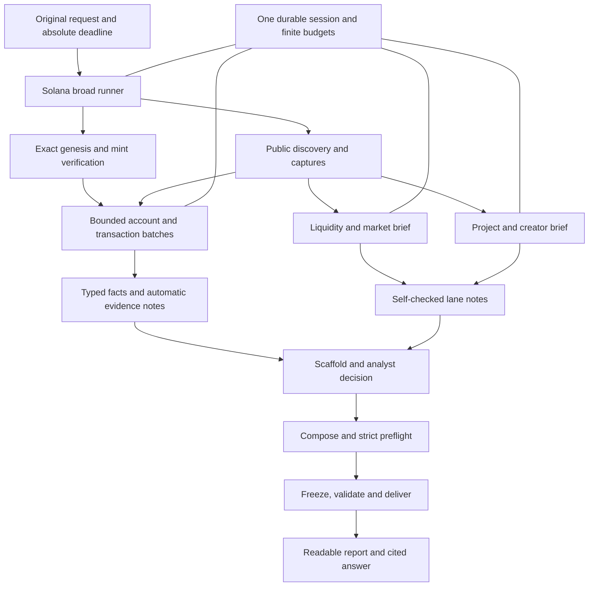

# Plan: Solana diligence parity with the current EVM workflow

Prepared **2026-09-11** against checkout **`fc60201`**, after a read-only review of current code, tests, guidance, September 6–11 Git history, EVM implementation/review records, and selected official Solana/protocol documentation. This is an executable implementation plan, **not an implementation record**. No tests, builds, collectors, provider checks, or token investigations were run while preparing it. The only project change is this Markdown file.

## Current Understanding

- The goal is to give the Solana specialist comparable **research substance, evidence discipline, readable conclusions, and end-to-end efficiency** to the current EVM specialist. The user delegated architectural choices and requested a plan without a new-feature interview.
- EVM is now an integrated investigation system. Solana has a defensible mint-sampling packet and basic bundle contract, but most broad research and reconciliation remain instructions for the model to execute manually.
- Success means a fresh, exact-mint investigation that screens all eleven surfaces, preserves useful observations and material concerns, explains genuine gaps, answers the user's particular question, and delivers a validated report in a **5–7-minute target / 10-minute ordinary stop boundary**. Shorter user deadlines always control. A fast packet full of avoidable unknowns is not success.
- This is a Solana-native implementation. EVM block pins, runtime checks, proxy slots, event topics, LP NFTs, Safe assumptions, and source matching cannot simply be renamed. Solana account contexts, programs, token-account owners, position models, transaction instructions, and upgrade controls need their own contracts.
- Preserve public-RPC/explorer/API access as the Solana default, standard-library Python, chain routing, read-only behavior, frozen provenance, existing registrations, and the prohibition on commits/pushes. Paid EVM authorization is not a reason to configure or use paid Solana access.

### Current architecture, verified from source

Paths below are repository-relative to `~/code/crypto-research`. `E` means `skills/crypto-evm-token-due-diligence`; `S` means `skills/crypto-solana-token-due-diligence`; `R` means `skills/crypto-token-due-diligence`. These abbreviations are path prefixes, not shell variables.

| Area | EVM now | Solana now | Consequence |
| --- | --- | --- | --- |
| Releases | Workflow **3.2.7**, backend **3.4.2**, reporting **2.6.2**, pipeline **1.0.2**; investigation schema 3 | Workflow **1.0.1**, engine **1.0.0**, packet schema 1 | Solana has not received the recent backend/reporting redesign |
| Implemented size | 26 Python scripts, 9,146 source lines, 28 reference files | 3 Python scripts, 662 source lines, 2 references | Scope differs substantially; matching line counts is not a goal |
| Test inventory | 30 `test_*.py` files, 426 statically declared test methods | One file, 23 statically declared test methods | These are source counts, not executed test totals or quality scores; historical EVM runs report 428 tests |
| Entry/orchestration | `broad_collect.py start`, four dependent RPC phases, source/discovery capture, automatic findings, two briefs, bounded presets | `solana_collect.py` fixed sequence, then manual research and `solana_bundle.py init` | No supported Solana broad pipeline, presets, facts view, or lane protocol |
| Budgets | Persistent `investigation.py` SQLite ledger; reservations, retry accounting, restart continuity, phase timeline | Per-process attempt lock/cap and process timeout; inherited chat deadline is instructional | Separate collections/web reads can receive fresh local allowances; no machine-enforced investigation-wide budget |
| Initial evidence | Controls, pools, balances, source correspondence, creation receipt, positions/controllers, quotes, sampled sales, holders, maturity when supported | Genesis, two mint samples, four header captures/rechecks, final genesis; optional largest-account list | Eight reads, nine with largest accounts; no pool, transaction, controller, or owner aggregation implementation |
| Collection strengths | Strict EVM wire validation and rechecked pins | Case-sensitive 32-byte identities; account owner/layout validation; exact supply; selected Token-2022 extensions; separate finalized contexts; retained failures | Preserve Solana's existing good boundaries rather than replace them with EVM assumptions |
| Evidence/report | Typed subject/support, derived-input closure, execution effects, coverage/closure review, decision review, human-readable rendering | Hash-bound artifacts and target, findings with evidence IDs, ratings, mostly free-text provenance; JSON fences as report sections | Solana lacks machine checks for several claim-to-evidence relationships and an effective reading layer |
| Completion | Completed bounded investigation may retain evidenced external unknowns; checkpoints are distinct from final delivery | `completed` requires all eleven ratings non-unknown and `coverage == complete` | Solana confuses completion of an investigation with complete knowledge of every dimension |
| Replay | Frozen reporting dependency snapshot; verify without execution; explicit trusted replay | Collector snapshots five source files; validation recomputes with installed `summarize`; renderer is not snapshotted | Existing Solana snapshot is not a self-contained frozen reporting engine |
| Maintenance | Structured operational observations, reviewed/versioned/expiring lessons | No corresponding tooling or memory file | Repeat failures can cost new model turns on each investigation |

The collector's current import is `S/scripts/solana_collect.py → E/scripts/rpc_collect.py → backend_common.py / rpc_wire.py / validate_bundle.py`. `run_bounded()` snapshots `solana_collect.py`, `solana_common.py`, `rpc_collect.py`, `backend_common.py`, and `validate_bundle.py`, omitting current transitive imports such as `rpc_wire.py` and `report_profile.py`. `solana_bundle.collection()` uses the installed summarizer and exact installed engine constant. **Observed from code:** snapshots are incomplete for isolated execution, and compatibility is not insulated from future engine changes. **Not claimed:** a reproduced live failure or corrupt existing evidence.

The existing validator also provides less semantic structure than EVM: derived rows have a free-text source rather than a required transitive input ledger; findings lack typed subject/support roles and transaction effects; a referenced genesis/mint pair can satisfy identity without a general scan for contradictory successful network observations. These are specific regression targets, not evidence that every existing report is wrong.

### What changed in EVM over the last few days

| Date / commits | Change and evidence | What Solana should inherit |
| --- | --- | --- |
| Sep 8 — `a496a43` | Strict subject/support and execution binding, derived-input closure, source correspondence, supported bootstrap/assembly, persistent sessions, rolling scheduling, maintenance observations, frozen replay. See `plans/evm-skill-audit-2026-09-08/implementation.md`. | Evidence contracts and maintained helpers before broader automation; versioned replay and same-investigation accounting |
| Sep 9 — `8782912`, `ace3e2d` | Separate Unverified from adverse findings; adoption/economics calibration; evidenced stopping review; four-axis decision review and explicit user requirements. | Missing access is neither a pass nor an accusation; verified delivery/adoption deserves bounded credit; severe powers remain visible |
| Sep 9–10 — `4f03e33`, `bf814d6`, `63b010f` | Completion gates, same-ledger continuation, actual delivery checks, multi-error preflight, removal of mandatory research homework. These revisions temporarily favored longer completion-driven work. | Keep the completion/delivery distinction and actionable errors; do **not** restore long serial investigations or compulsory follow-up lists |
| Sep 10 — `25e6d31` | Standard broad pipeline, compact note composition, facts, built-in presets, bundled deterministic helpers, two bounded lanes, batch capture, reduced mandatory reading. | Eliminate per-run scripts, raw-JSON context dumps, budget ceremonies, and late lane starts |
| Sep 10–11 — `3feae52` and its review records | Structured failures/restart, pointer briefs, lane self-check, scaffold, deterministic pipeline findings, deeper creation/custody/holders/sales; production fixes for retry/redirect accounting, missing-value semantics, same-pool sale matching, checkpoints. | Port **reviewed behavior**, including failure cases; carry useful depth automatically without extra coordinator turns |
| Sep 11 — `5f22f85`, `f740baf`, `d1993bd` | First-call host-network permission handling; full question/focus/URLs in briefs; distinguish sampled sale verification from overall trading activity. Delivery/citation records also preserve exact holder aggregates and mandatory reading details. | Correct host execution context on the first live call; lossless intake; no misleading “only two sells” summaries; cite from existing report evidence |
| Sep 11 — `fc60201` | Lightweight candidate-only router with preserved original request and absolute timing. | One identity verification by the specialist, no clock reset, no native-asset routing loop |

`git diff 7deacf6..fc60201 -- S` shows the Solana code changed only in the provider-ready gate plus one regression; other changes were routing/timing/provider documentation and release metadata. It has not gained EVM's recent collection or reporting capabilities indirectly. Improvements to the imported HTTP transport do not supply a Solana session, cache, wire validator, or orchestrator.

### What the performance evidence actually establishes

- The recorded 45.1-minute PONS investigation spent only **24.6 seconds** in ten RPC collections, while authoring a 43 KB assembly script and exchanging many lane messages. The plan's measured baseline is in [the EVM performance audit](evm-performance-optimization-2026-09-10.md).
- A subsequent **12 min 45 s / 73-turn** run spent **86%** of elapsed time in coordinator model work. A **6 min 42 s / 34-turn** run was fast but thin because discovery failures suppressed useful downstream research. These are recorded historical runs, not new measurements: [live results](evm-performance-optimization-2026-09-10/live-results.md).
- The later 14.1-second pipeline smoke produced eleven automatic findings; it was a pipeline measurement without the full lane/coordinator workflow. The production review's same-input synthetic comparison retained **78 RPC calls / 87 charged attempts**, with median local pipeline time **0.4107 → 0.4389 seconds**. It showed bounded overhead and corrected failure accounting, not a new live speed guarantee: [production review](evm-production-review-2026-09-11.md).
- No current full Solana broad-run baseline or latest-version full EVM/Solana head-to-head benchmark was established in this planning review. Do not promise a measured speedup from 23 old unit tests or compare an eight-read mint packet against a complete broad report.

## Decisions Resolved

1. **Port the workflow and evidence principles, implement Solana semantics.** Keep the eleven existing Solana dimensions. Add assessment topics and four synthesis axes without resurrecting the retired numeric market rubric.
2. **Make Solana self-contained.** Introduce small Solana-local transport, session, and capture modules derived from the reviewed EVM implementations. Record origin commit and adaptations. Do not copy the 9,146-line EVM engine, import its validator/cache/pin logic, or undertake a shared-framework extraction as a prerequisite. Bounded duplicated infrastructure is preferable here to coupling Solana's release/replay to EVM internals. Contract tests and explicit upstream review manage drift.
3. **Use a versioned v2 packet/report contract.** New collection/bundle schema 2 and profile `solana-evidence-v2`; target the first full activation at collector/reporting/workflow **2.0.0**, with initial session/note/adapter contract versions **1**. Track these components independently thereafter and record intermediate development versions explicitly. Keep schema-1 evidence readable through an explicit `legacy-v1` compatibility path retaining engine **1.0.0** semantics. Never add new-profile markers to old evidence or rewrite historical snapshots.
4. **Separate collection, coverage, and delivery.** A successful mint phase is not broad completion. A completed investigation may have unknown ratings after real bounded attempts. Untouched work, an absent lane, a local helper failure, or elapsed time alone cannot be relabeled an external boundary.
5. **Automate factual work, retain analyst judgment.** Deterministic modules derive controls, quantities, pool/position observations, transaction effects, and maturity facts. They do not autonomously assign a positive verdict, allege fraud, or infer a human identity.
6. **Two research lanes in the finished workflow.** Liquidity/market and project/creator use self-contained pointer briefs, separate note files, shared captures, hard absolute cutoffs, and one final self-checked return. The coordinator owns RPC, shared mutable state, and final judgment. If agents are unavailable, execute the same checklists locally within the same budget. This describes future research execution, not delegation during this planning task.
7. **One fresh investigation per new request.** New session, observations, and mutable-state reads. Within an active investigation/follow-up, reuse captured observations with their original contexts. Formatting/replay reads the frozen report without recollection. Explicitly distinguish these cases in the skill.
8. **No universal protocol support claim.** Required first-release adapters cover Raydium AMM v4/CPMM/CLMM, Orca Whirlpool, Meteora DLMM/DAMM v2, and Pump bonding curve/PumpSwap, with a capability matrix per deployed version. Raydium LaunchLab, Meteora DBC, unfamiliar lockers, custom hooks/loaders and other products are discovered and investigated through bounded sources; automated semantics remain explicitly unsupported unless a tested adapter exists. Do not label that implementation gap “all routes exhausted.”
9. **Public access, capability-based fallback.** No new key/account/setup prerequisite; no personal browser tabs. A quote API is optional, since availability/auth requirements change. Maintain a public-data route and protocol-specific estimates where valid; unmeasured exit cost remains a gap.
10. **Optimize model work first.** One start, two pointer spawns, compact facts, at most two conclusion-changing preset batches, sequential note composition, scaffold, finalize, one repair pass, existing report read, answer. Do not set a required count of favorable findings.

## Open Questions

No user decision blocks implementation. The following are bounded engineering checks with owners and gates:

- **Exact upstream revisions/layouts:** the implementing task resolves and records immutable official source/IDL revisions in Phases 4–11 before enabling an adapter. If correspondence is unavailable, retain unsupported capability status and document the release limitation; never guess offsets.
- **Public quote/source capabilities:** Phase 6 records endpoint/auth/response capabilities; Phase 10 verifies the actual quote path. A keyed-only service remains optional and is not silently configured.
- **Live acceptance identities:** Phase 18 selects three exact mainnet mints from authoritative project sources and records why each exercises the intended architecture before collection. That execution request authorizes only the bounded free reads specified there; any paid route needs applicable Solana authorization.

## Assumptions To Validate

| Assumption | Method / timing | Consequence if false |
| --- | --- | --- |
| Model orchestration overhead is a principal Solana cost too | Phase 18 measures coordinator turns, lane runtime, helpers, RPC, and total elapsed separately | Optimize the measured bottleneck; do not claim EVM percentages apply to Solana |
| Public reads can establish a useful baseline within the default envelope | Fault fixtures first, then three bounded live cases in Phase 18 | Reduce optional breadth, preserve material evidence, publish an honest coverage/latency limitation; no automatic paid fallback |
| Required protocol layouts can be pinned to official publications | Adapter source manifest and positive/negative fixtures in each adapter phase | Do not enable an unverified parser; fail the corresponding adapter release gate or report it as an explicit unfinished capability |
| Current schema-1 behavior can be reproduced without current EVM imports | Legacy CLI/byte comparison in Phase 1 | Repair compatibility before changing the default format; old evidence remains untouched |
| Small local infrastructure ports are easier to maintain than a shared-framework refactor | Import-closure, source-origin, transport-contract checks in Phase 2 and release review | Reconsider only the narrow module boundary if a concrete defect requires it; no wholesale EVM migration |

## Recommended Design

### Architecture and file boundaries



Use `solana_` names for top-level modules, unlike EVM's generic `facts`, `compose`, and `validate_bundle` names. Avoid `sys.path` mutation into sibling skills. Keep protocol code under `scripts/adapters/` with a small explicit interface; no runtime plugin loading or execution of fetched code.

| Module group (proposed unless marked existing) | Responsibility |
| --- | --- |
| Existing `solana_common.py`; new `solana_addresses.py`, `solana_wire.py` | Canonical base58 keys/signatures, safe integers, bounded binary/PDA primitives, method-specific request/response validation |
| `solana_transport.py`, `solana_session.py`, `solana_cache.py` | HTTPS/provider gates/redaction; durable requests/deadlines/reservations; observation reuse without false exact-state caching |
| Existing `solana_collect.py`; new `solana_presets.py` | Scheduled bounded read batches and dependency expansion, no financial judgment |
| `solana_accounts.py`, `solana_programs.py`, `solana_transactions.py`, `solana_quotes.py`, `adapters/*` | Tested Solana account, controller, execution, pool and quote semantics |
| `solana_web_capture.py`, `solana_discovery.py`, `assets/network-registry.json`, `assets/protocol-registry.json` | Safe retained captures, source deduplication, exact-identity candidates, pinned capability registry |
| `solana_facts.py`, `solana_pipeline_note.py`, `solana_compose.py`, `solana_scaffold.py` | Compact evidence views and mechanical expansion of analyst/lane notes |
| Existing `solana_bundle.py`; new `solana_profile.py`, `solana_render.py`, `solana_replay.py`, `solana_legacy_v1.py` | Versioned validation, readable frozen reports, final delivery gate, trusted replay, historical compatibility |
| `solana_broad_collect.py`, two `assets/lane-brief-*.md` | Standard start/collect/brief sequence, stable handoffs and intake propagation |
| `solana_operations.py`, `solana_maintain.py`, `memories.md` | Bounded operational feedback; separately reviewed lessons, never token state or provider authorization |

All live entry points call the same session and transport gates. Offline decoding, facts, compose, render and validation must work with no endpoint, sibling EVM installation, or network permission.

### Run, timing, and budget contract

The proposed commands are **not currently available**. Implement them in the phases below before advertising them in `SKILL.md`.

- `solana_broad_collect.py start --mint ... --genesis-hash ... --run ... --question ... [--focus ...] [--url ...] [--handoff ...] [provider flags]` creates a fresh run and standard work plan. The handoff carries the original request, all URLs/metadata, `received_at`, `target_at`, and `deadline_at`. Never infer `received_at` from the time the collector finally starts.
- `collect --run ... --preset accounts|programs|holders|pools|positions|transactions|launch|quotes ...` expands one bounded question into dependent read batches. At most two coordinator preset invocations ordinarily; internal dependencies count against the same budget. No new session on retry or fallback.
- `solana_bundle.py facts|compose|scaffold|finalize|deliver ...` provides the short analyst workflow. `compose --check` is read-only and lane-scoped; notes are composed serially by the coordinator. Finalize performs compose, preflight, freeze, render comparison and delivery, returning the report path, concise findings, unresolved material checks and mandatory reading checklist.
- `solana_replay.py verify|replay ...` never recollects token state. Execution of frozen code requires explicit trust; hash verification does not.

Initial configurable **engineering budgets**, not measured requirements: **120 total network attempts**, at most **3 concurrent RPC calls** and **2 calls per public web-capture origin**, 15 web attempts per lane, 12 attempts reserved for retries/final verification, and the remaining 78 shared across ordinary discovery/RPC/presets. Count real retries and redirect hops. `getMultipleAccounts` is one RPC method call but also records account count/bytes; do not hide expensive work behind request counts. Planned needs exceeding this envelope fail admission or shed optional work before collection; never silently increase it. Validate/tune this default in Phase 18 while preserving an explicit finite cap. Lower advertised provider/method limits take precedence over these defaults; do not assume a concurrency limit is a requests-per-second limit.

Reserve final verification requests **before** discretionary expansion. The initial 12-attempt reserve is split between the bounded verification plan and contingency; if needed verification will exceed it, reserve the additional amount from the ordinary allowance before scheduling that expansion. Lane grants are reserved once and durably consumed; report actual usage and outstanding reservations separately. Concurrent lane calls cannot each receive the full remaining grant. A rejected provider preflight consumes no restart marker and mutates no unrelated directory.

Target schedule, always clamped to the actual remaining time:

| Elapsed from original request | Milestone |
| --- | --- |
| 0:00–1:30 | Intake/provider policy, verification, discovery and standard collection; briefs ready with useful facts |
| As soon as start returns, target by 1:30 | Spawn both lanes from printed pointers before a separate facts-reading turn |
| 1:30–4:00 | Coordinator facts review and at most two useful presets while lanes run |
| 4:00 | Absolute lane cutoff; retain completed captures/notes |
| 4:00–5:00 | Compose notes, run any already-reserved final consistency checks, scaffold and judgment |
| 5:00–7:00 | Finalize, at most one repair pass, report read and answer |
| 8:00 | No new collection/presets; two-minute delivery reserve before ordinary 10-minute boundary |

Define collection cutoff as the earlier of the selected collection window and `deadline_at - 120`; lane cutoff as the earliest of `received_at + 240`, collection cutoff, and any shorter user limit. Never grant a lane four fresh minutes after a late start. For very short requests, do not launch work that cannot fit; deliver an explicitly partial/blocked answer with saved evidence. Past the ordinary boundary continue only for a named conclusion-changing trigger, within an already authorized finite ceiling; a user hard deadline is never overridden. No routine 1,500-second ceiling copied from EVM's example command.

### Solana evidence contract

**Identity and state.** Keep `(genesis_hash, mint)` case-sensitive. Validate account owner program, initialization, byte length and layout before claiming a mint. Track `sample_id`, request/response IDs, address-to-array-index mapping, encoding, commitment, context slot, capture time and associated header/recheck references for each observation. Scan all successful network/header observations for contradictions, including unused ones. Missing account data, a null response, stale context or unknown program remain distinct statuses.

Use `getMultipleAccounts` for related mint/holding-account/pool/vault samples and record the returned context. The official API supports up to 100 addresses and preserves request order; start with a smaller byte-bounded chunk size. This is a batching opportunity, **not** permission to assign one historic slot to separately collected state. [Solana RPC reference](https://solana.com/docs/rpc/http/getmultipleaccounts)

Cache immutable captured observations, not “current state at minContextSlot.” A state lookup may reuse a named earlier sample only with that sample's original context and explicit age/drift limits; identical request parameters do not guarantee an identical current-state result. Fresh mutable-authority rechecks bypass reuse. Within one sample plan, deduplicate compatible reads and header work while retaining independently captured later rechecks. A changing mint is an observed transition: invalidate conclusions that require stability, preserve unaffected observations, and never silently overwrite one sample with another.

**Ownership and programs.** Separate the account's owning program, token-account spending authority, delegate/close authority, PDA derivation/controller, and human beneficial ownership. A missing account or system-owned address is not proof of an EOA-like actor. Resolve known loader/program-data links and upgrade authority, supported SPL multisigs and Squads v4 configuration, including alternative permission paths. A PDA label alone never proves locked principal. Squads includes config authority, member permissions and time-lock/spending-limit concepts; threshold alone is incomplete. [Squads account reference](https://docs.squads.so/main/development/reference/accounts), [permissions](https://docs.squads.so/main/development/reference/permissions)

**Amounts.** Atomic integer strings are authoritative. Compute supply/holder aggregates deterministically, retain exact denominators and rounding policy, identify sample exclusions and missing accounts, and re-read selected holdings with the mint when possible. Largest-account discovery is a sample of up to 20 token accounts, not a census or 20 people. Do not import EVM's dead-address assumption: a Solana burn instruction reduces supply; merely sending tokens to a labeled address is a different proposition. [Largest-account RPC](https://solana.com/docs/rpc/http/gettokenlargestaccounts)

**Transaction evidence.** Verify canonical 64-byte signatures separately from 32-byte keys, the requested signature's presence, supported version, successful or failed execution, account-index mapping, and historical slot/header. Decode standard instructions and relevant inner instructions from preserved raw data. Versioned keys, missing balance metadata, temporary WSOL accounts, rent, fees, and pool-specific account roles need explicit treatment. A transfer to a vault is not by itself a sale; neither a fee payer nor a transaction signer is automatically the economic seller. [Transaction RPC](https://solana.com/docs/rpc/http/gettransaction)

**Derived and documentary claims.** Every derived fact carries operation/version/parameters, exact input IDs and digests, units, output, and transitive dependency closure. Failed inputs can support an attempt/gap, never a resolved direct claim. Documentary facts can establish what a project/auditor says without pretending to prove executable behavior. Source-to-program correspondence distinguishes published source, third-party verification, byte/hash correspondence and independently reproduced builds. Ordinary diligence does not install a Rust/Anchor toolchain or run an untrusted repository to manufacture assurance. [Program deployment model](https://solana.com/docs/programs/deploying)

### Research coverage and protocol adapters

Each adapter exposes `recognize`, `decode_accounts`, `required_reads`, `decode_execution`, and a capability descriptor. Unsupported operations return a typed gap; they never guess a compatible layout. The registry binds genesis, program ID, product/version, discriminator/layout, immutable source/IDL revision and hash, required dependencies, and capabilities for identity, reserves, custody, transactions and quotes. Verify actual owners/configuration on each investigation. Publication is a decoding premise, not deployed-source proof.

| Surface | Standard automatic evidence | Lane/analyst responsibility and boundary |
| --- | --- | --- |
| `token_controls` | Mint and token-account controls; known Token-2022 configurations; epoch-dependent fees; controller/program observations | Interpret material capabilities, custom hooks, remaining extension/build limits |
| `canonical_lp_principal_custody` | Verified pool/vault/mint relationships; known LP/position account and custody/delegate paths | Assess principal withdrawal/lock conditions and what portion is actually covered |
| `side_pool_removal_risk` | Deduplicated discovered side pools, their program/product identity and sampled balances | State search universe and omitted pools; do not equate the principal pool with all liquidity |
| `sellability_exit_depth` | Supported swap execution samples, three disclosed quote/probe sizes, fees and relevant liquidity state | Separate market activity, sample verification, user-reported execution and unmeasured size effects |
| `current_concentration` | Top-account discovery, same-batch mint/holding reads, owner aggregation, explicit exclusions | Custody labels, owner-versus-beneficiary limits, defensible clustering only |
| `historical_launch_integrity` | Bounded initialization, authority transitions, launch/curve/migration and verified transactions | Creator allocation/trading and prior launches; declare interval/pages and left-censoring |
| `admin_treasury_reward_custody` | Reachable authority graph, known multisigs, treasury/reward/fee accounts and program upgrades | Explain actual control and residual bypass/upgrade paths |
| `reward_accounting_liveness` | Identified reward asset, balances and observed payouts where supported | Liability/funding reconciliation for claimed mechanisms; no N/A based only on silence |
| `utility_redemption_rights` | Linked programs/instructions/accounts for known entitlements | Verify delivered utility, rights, backing and operator discretion; project success is not holder entitlement |
| `external_dependencies` | Quote assets, token programs, pool/hook/oracle/controller dependencies and exact identities | Bounded bridge/LST/stablecoin/operator exposure; separate external-network evidence |
| `development_disclosure` | Program/build/source records and dated indexed maturity metrics | Work versus marketing, audits, public operating history, team attribution, actual adoption and contrary evidence |

Start with at most six discovered material pool candidates, one principal pool plus selected meaningful alternatives, 20 holding accounts, two ordinary-sale candidates, and two pages of at most 25 signatures per specifically selected address. These are configurable probe caps, not population claims. A user-named pool/wallet/transaction takes priority and displaces optional work. No all-program scans, lifetime wallet reconstruction, or unbounded position enumeration in ordinary mode.

Pool work must distinguish custody from exit depth. Constant-product, hybrid orderbook, concentrated-range, bin and launch-curve models require different reserve and principal calculations. No universal “LP locked percentage” or `vault balance = executable liquidity` formula. Account relationships and layout fixtures precede quoting. Official version/source entry points include [Raydium IDLs](https://docs.raydium.io/sdk-api/anchor-idl), [Orca's program repository](https://github.com/orca-so/whirlpools), [Pump's public documentation and IDLs](https://github.com/pump-fun/pump-public-docs), and [Meteora's product documentation](https://docs.meteora.ag/faq/how-do-i-create-a-new-farm).

Quote acquisition is read-only and wallet-free. Adapter estimates require all state/fee/tick/bin inputs they use and carry model limitations. API quotes retain source/time/route/context and do not become raw execution evidence. Jupiter's inspected v1 documentation currently calls that API superseded and shows API-key use; do not hardcode an old anonymous Jupiter endpoint as an essential path. Resolve current capabilities during implementation. [Jupiter quote documentation](https://developers.jup.ag/docs/swap/v1/get-quote)

### Findings, completion, and answer contract

Adopt EVM's compact note vocabulary where semantically appropriate: `state_observation`, `source_analysis`, `historical_execution`, `inference`, `coverage_gap`; explicit strength/confidence/impact; adverse `concern {basis, mechanism, consequence}`; exact subject and participants; typed support roles and counterevidence. Use Solana sample/transaction references in place of EVM pins/receipts. Unknown IDs, ambiguous aliases, wrong subjects, placeholders and unsupported promotions produce field-specific preflight errors.

Coverage is separate from ratings: `checked`, `partial`, `unavailable`, `not_checked`, `not_applicable`, with findings, attempt evidence, decision impact and closure. Completed broad delivery permits residual unknown ratings with an evidenced standard-scope boundary; it rejects untouched/pending work, fabricated N/A, budget-only closure and focused scope mislabeled broad. Mark unsupported implementation distinctly from inaccessible published evidence. Perform a feasible fallback inside standard scope; if not done, retain a partial checkpoint rather than claiming a completed investigation.

Four decision axes: **Technical exposure**, **Credibility and maturity**, **Token economics**, **Research confidence**. Verdict kinds and adverse mitigation requirements follow the current EVM decision rules, translated into the Solana schema. Requirements quote the user's actual words; illustrative exit sizes are not their position. Zero actions is valid; no mandatory investigation homework.

Frozen output: human-readable report, conditional verdict, evidence-dependent summary, detailed eleven-surface coverage, full ledger, source/time/units, and a 300–600-word chat answer with 4–8 assessed findings when evidence supports them, separate **⚪ Unverified**, adjacent existing source links, and exactly four conclusion bullets. Retain concentration numbers/sample limits, named custodian/controller and unresolved powers, holder economics, source/audit/team/adoption assurance limits, and the user's focus. No fixed number of Good findings, new icon requests or extra link-fetch turns. Broad trading activity leads when evidenced; a two-sale verification sample is never described as the market's total activity.

## Rejected Options

- **Documentation-only parity:** leaves manual query planning, facts arithmetic, assembly and validator repair—the principal EVM bottlenecks—in place.
- **Copy/rename the EVM engine or use its profile directly:** imports false pin, account, sale, proxy and custody assumptions and increases coupling.
- **Extract a universal shared framework first:** would enlarge the EVM/Claude change surface, delay Solana improvements and require a cross-family migration without demonstrated need. Revisit only after stable compatible interfaces exist.
- **Retain the direct import of the whole EVM RPC collector:** keeps offline Solana imports and snapshots coupled to unrelated EVM reporting changes. A narrow local port with provenance is the chosen boundary.
- **Make paid RPC or a quote API key mandatory:** conflicts with the user's public-Solana preference and makes ordinary completion depend on new setup.
- **Make every unknown prevent completed research:** encourages invented passes or endless work. Conversely, timeouts alone cannot justify completion.
- **Optimize with Rust, external SDK installs, transport replacement, WAL, or large scans first:** no measured benefit justifies these prerequisites; exact byte decoders and orchestration fit standard-library Python.

## Risks And Mitigations

- **False parity from superficial output:** require fact-level scenario expectations and preserved contrary evidence, not color counts or faster completion alone.
- **Solana consistency overclaim:** typed sampled contexts, coherent batches, explicit drift, mandatory critical rechecks and no `minContextSlot`-as-history cache.
- **Unsupported protocol guessed as a common one:** registry/capability gates, wrong-program/layout near-neighbor tests, explicit unsupported status and no broad promotion.
- **Infrastructure drift after the local port:** origin hashes and compatibility vectors; review upstream failure fixes during maintenance without automatically changing runtime code.
- **Budget races, restart resets, lost partial output:** durable acquire-before-send, per-lane reservations, atomic writes, same-session resume, killed-process fixtures.
- **Validator becomes a prose truth oracle:** keep semantic review explicit; typed roles validate necessary relationships, not arbitrary financial meaning.
- **Legacy replay breaks:** preserve schema-1 interpretation and bytes first; introduce v2 independently; verify without running untrusted frozen code.
- **Public API failures or rate limits:** per-origin concurrency, one bounded transient retry and one permitted alternative; retain positive observations and precise gaps. No bypass of denied host permissions.
- **Scope inflates to every Solana protocol:** fixed first-release adapter list and capability matrix. Missing required adapters are unfinished parity work, not a retrospective completion claim.

## Repo Execution Notes

- Read root `AGENTS.md`, current `README.md`, and the top of `HANDOFF.md` at each execution handoff. Edit canonical `S`. Keep `history/`, archived plans/research, credentials and source snapshots unchanged. Existing personal Solana/router links and project-only EVM registration stay in place.
- This plan proposes no EVM implementation changes or Claude Solana port. If a concrete shared defect requires an EVM edit, record the scope change, edit canonical EVM first, mirror only per `.claude/skills/crypto-evm-token-due-diligence/CLAUDE-CODE-PORT.md`, and run both EVM suites. Do not add personal EVM registration or modify global permissions.
- Python **3.10+**, standard library only. No package manager/build/install step exists for these helpers. New modules use `solana_` names and explicit imports; protocol adapters are local reviewed modules. Source files downloaded for layout research are data, not importable runtime dependencies.
- Follow implement → review → improve → validate in every phase. Add behavior regressions where introduced. Review negative cases and financial interpretation as well as CLI success. A phase may not waive its acceptance gate because later work is planned.
- Keep a phase execution record at new `plans/solana-evm-parity-2026-09-11/implementation.md` **during implementation**, recording changed paths, versions, checks actually run, limitations and the next phase. Runtime outputs go under ignored `research/`/`runs/`; curated small synthetic fixtures and benchmark results may be tracked under the skill/tests or that plan directory.
- Each behavioral phase updates `S/assets/release.json` with the changed component version and execution-record link. Keep existing `engine_version` as an explicitly documented collector compatibility field; add independent reporting/workflow/profile/adapter versions rather than using one ambiguous version for everything. Release v2 defaults only after the final gates.
- Root documentation has historical counts/timing language that is no longer current: `HANDOFF.md` still mentions four canonical skills/three other personal links, and older README/release narratives describe longer EVM timing. Correct current-state summaries in Phase 17; preserve historical records and use the current runbook's policy. A stale README “commit” instruction never overrides the user's no-commit rule.
- Before any future live collector/capture, distinguish internal `--allow-network` flags from the host's network permission. Honor the declared host policy on the **first** call, per-command escalation when offered, and denials. No provider or credential checks are needed for offline implementation tests. Never print private env values; use the existing documented sourcing procedure if applicable, without reusing the Robinhood endpoint for Solana.

Commands below were verified by reading README/CLI parsers, **not run in this planning task**. Working directory for every validation command is `~/code/crypto-research`.

```sh
# Existing documented regression suites
PYTHONDONTWRITEBYTECODE=1 python3 -m unittest discover -s skills/crypto-solana-token-due-diligence/tests -q
PYTHONDONTWRITEBYTECODE=1 python3 -m unittest discover -s skills/crypto-token-due-diligence/tests -q
PYTHONDONTWRITEBYTECODE=1 python3 -m unittest discover -s skills/crypto-evm-token-due-diligence/tests -q

# Existing Claude mirror check, required if EVM/shared implementation is changed
PYTHONDONTWRITEBYTECODE=1 python3 -m unittest discover -s .claude/skills/crypto-evm-token-due-diligence/tests -q

# Existing Git whitespace check; never commit/push as part of a phase
git diff --check
```

For each test filename named in a phase's validation, the exact command template is `PYTHONDONTWRITEBYTECODE=1 python3 -m unittest discover -s skills/crypto-solana-token-due-diligence/tests -p '<named-test-file>' -q`, substituting that filename. This uses existing Python discovery syntax but refers to **new tests to create in that phase**. Do not report them as available or passing beforehand. Run the targeted tests plus the full Solana suite for each implementation phase; use all three README suites at integration/release boundaries. Do not install PyYAML or other dependencies just to run an optional skill validator.

## Implementation Phases

Complete phases in order. Each new task reads this plan and the implementation record, rechecks applicable guidance/current changes, executes only its authorized phase, verifies the acceptance criteria and stops. Later phases reference already-established contracts; they do not silently redesign them.

Execution authorization update (2026-09-11): the user requested all phases in one
continuing implement-review-improve workflow, with acceptance verification and an
updated implementation record before each next phase. The user also requested a
five-minute round of research into current useful Solana on-chain tooling. That
research is a Phase 2 gate, before expanding RPC/account methods in Phase 3, and
informs Phases 3–11. Public RPC URLs remain the current default; configuring a
custom dRPC URL is future work and is not authorized by this addition.

### Phase 1: Capture compatibility and specify the v2 contracts

**Goal:** Establish a reproducible starting point and exact contracts before broadening behavior.

**Dependencies:** None.

**Files to create/modify or deliverables:**

- New `S/references/bundle-v2.md`, `S/assets/note.template.json`, `S/assets/work-plan.template.json` — schemas and field contracts described above.
- New `S/scripts/solana_legacy_v1.py`, `S/tests/test_solana_legacy.py`, `S/tests/fixtures/legacy_v1/` — explicit schema-1 compatibility and small golden fixtures.
- Existing `S/scripts/solana_bundle.py`, `S/assets/release.json` — profile dispatch/version declarations; preserve the current default until activation.
- New `plans/solana-evm-parity-2026-09-11/implementation.md` and `baseline.json` — source hashes, versions, actual baseline suite results and phase status.

**Tasks:**

1. Run the existing three README suites and record actual results. Record current script/reference hashes without editing historical evidence or assuming source-method counts equal executed test counts.
2. Produce synthetic schema-1 collection and independent-evidence fixtures using the trusted current implementation. Preserve expected manifest/report/rendered bytes and rejection cases before editing behavior.
3. Isolate schema-1 deterministic decode/summarize/validate/render behavior in an installed compatibility module that does not require EVM/network imports. Preserve its version semantics; do not claim that old incomplete snapshots became standalone.
4. Specify v2 target/scopes/samples, request observations, derived inputs, transaction effects, coverage/closure, decision, notes, completion and delivery fields. Separate `collection_status`, research completion and delivery eligibility. Define enums, integer encoding, identities and safe reference rules; add explicit profile dispatch with no automatic legacy promotion.
5. Record the phase review and versions. New v2 entry points remain opt-in until Phase 18; legacy reading remains explicit and supported afterward.

**Acceptance criteria:**

- [ ] Golden schema-1 output reproduces exactly through `--profile legacy-v1`; missing or altered evidence still fails.
- [ ] Offline legacy validation imports without the EVM sibling; old evidence is not rewritten.
- [ ] The v2 specification covers all eleven dimensions, note ownership and partial/completed/checkpoint distinctions without promising unknown facts are resolved.

**Validation:** Run `PYTHONDONTWRITEBYTECODE=1 python3 -m unittest discover -s skills/crypto-solana-token-due-diligence/tests -p 'test_solana_legacy.py' -q`, the full Solana suite and `git diff --check`. Review both successful golden rendering and negative fixtures manually against the baseline.

**Handoff and stop condition:** Save baseline results, compatibility fixtures and the v2 field contract. Stop before runtime/budget changes.

---

### Phase 2: Self-contained transport and durable investigation budgets

**Goal:** Make all subsequent live work share one finite, restart-safe allowance without importing EVM reporting code.

**Dependencies:** Phase 1.

**Files to create/modify or deliverables:**

- New `S/scripts/solana_transport.py`, `solana_session.py`, `S/assets/runtime-provenance.json`.
- Existing `S/scripts/solana_collect.py` — narrow transport/session integration behind v2 selection.
- New `S/tests/test_solana_transport.py`, `test_solana_session.py`, `test_solana_imports.py`.

**Tasks:**

1. Port only the reviewed HTTP/provider primitives from EVM `rpc_collect.py` and session/reservation ideas from `investigation.py`; replace dependencies on EVM validation with local primitives. Preserve HTTPS, no credential-bearing URL logging, explicit cost flags, zero-request availability, redirect refusal for authenticated RPC, response-size/time bounds and known-secret redaction.
2. Record source commit/hashes, adapted functions, local behavior differences and security regression vectors. A plain missing sibling installation must no longer disable Solana collection.
3. Persist original absolute timing, target identity, request and byte limits, attempt records, phase marks, reservations and retry eligibility in `session.sqlite`. Acquire before send using a transaction. Track actual attempts, reserved grants, method/account/byte counts and per-source failures separately.
4. Implement reserved lane grants and final verification allowance, one bounded retry per request family, and same-session restart/fallback. Require a recorded trigger for any allowed replan; never change a user hard deadline or reset consumed attempts. Enforce a finite total response-byte budget, initially 64 MiB, in addition to per-response limits.
5. Keep provider preflight read-only. Public Solana endpoint configuration uses a temporary dedicated variable; neither EVM configuration nor a saved key grants Solana paid permission.
6. Conduct a timeboxed five-minute review of current useful Solana on-chain tooling
   using official documentation and maintained primary repositories. Save actual
   start/stop times, dated source links and access/capability evidence in
   `plans/solana-evm-parity-2026-09-11/tooling-research.md`. Compare public RPC and
   explorer/indexer tools, account/program and transaction decoding, protocol
   discovery/quotes, source/build verification and authority/custody analysis.
   Identify anonymous/free availability, key requirements, rate/response limits,
   freshness, exact-mint provenance, licensing/runtime requirements and relevant
   security boundaries when documented; mark unknowns explicitly. Select concrete
   integrations and permitted alternates for Phases 3–11, explain rejected or
   optional tools, and map each accepted capability to its phase and regression
   checks. Currentness alone is not evidence of suitability. Keep Python runtime
   standard-library-only; no tool installs, paid access, credentials, wallet setup
   or trade execution. Custom dRPC setup remains deferred. Documentation reads do
   not establish live provider reliability or measured investigation performance.

**Acceptance criteria:**

- [ ] Parallel processes, retries, redirects and repeated batches cannot overspend; zero grants send zero requests.
- [ ] Restart preserves target, original deadline, attempts and grants; unrelated or already-finalized directories are refused without mutation.
- [ ] Late responses, secret echoes, malformed settings and missing permission remain typed failures with no fabricated state.
- [ ] Offline imports and provider checks create no files or network requests.
- [ ] The five-minute tooling review is recorded with sources, actual timing,
  access limits and concrete phase-mapped integration decisions; public RPC stays
  the default and custom dRPC configuration remains deferred.

**Validation:** Run the three new test files using `unittest discover -p`, then full Solana and all README suites. Use mocked transport/time and multiprocess budget tests, not live provider checks. Review behavior against EVM `test_retry_budget.py` and `test_production_runtime.py` vectors.

**Handoff and stop condition:** A standalone tested transport/session API and provenance record; stop before expanding methods or account reads.

---

### Phase 3: Method validation, account batches and honest sample reuse

**Goal:** Replace the fixed mint-only sequence with a bounded read engine that preserves Solana state semantics.

**Dependencies:** Phases 1–2.

Tooling follow-through: apply the public-RPC rate/response boundaries selected in
[the Phase 2 tooling review](solana-evm-parity-2026-09-11/tooling-research.md).
That review also supplies the concrete source/quote integration decisions for
Phases 4–11; retain its capability and licensing checks before enabling each route.

**Files to create/modify or deliverables:**

- New `S/scripts/solana_wire.py`, `solana_cache.py`, `solana_presets.py`.
- Existing `S/scripts/solana_collect.py`, `solana_common.py`.
- New `S/tests/test_solana_wire.py`, `test_solana_collector_v2.py`, `test_solana_cache.py`.

**Tasks:**

1. Define strict request/result validation for the required allowlisted RPC methods: genesis, account/multiple-account, block, epoch, largest holdings, supply, signatures, transactions, and narrowly justified account-owner lookups. Preserve raw errors/null/malformed/unsupported cases. Reject signing/broadcast, airdrop and remote simulation methods.
2. Build a dependency-aware queue with at most three in-flight RPC requests. Batch known related accounts in deterministic request order; chunk by account and response limits. Validate every returned position, including null members, rather than zipping a shortened array silently.
3. Capture genesis and every relevant response context. Reserve and execute fresh header/network/critical-state rechecks; require they occur after their initial observations. Deduplicate headers within a batch plan without using the initial header as its own recheck.
4. Cache only captured observations with provider namespace, investigation ID, genesis, full request parameters, sample ID/context, synthetic mode and digest. Explicit freshness checks select reuse; new mutable-state reads/rechecks cannot be satisfied by an old “same minContextSlot” result. Historical transaction reuse retains its original signature/slot/header.
5. Integrate process termination with the absolute session deadline. Preserve durable starts and completed replies even on timeout/import/summary failure. Return structured per-phase status and useful partial evidence.

**Acceptance criteria:**

- [ ] Wrong IDs/networks/subjects, result/error ambiguity, array length mismatch, unrequested addresses and contradictory headers cannot produce usable facts.
- [ ] Batches retain exact address/index/context relationships; mixed slots are explicit.
- [ ] Failed reads are not successful cache hits; rechecks are genuinely fresh; a restart does not replenish retry eligibility.
- [ ] Killed or deadline-expired workers retain attempts/replies and send no new discretionary reads.

**Validation:** Run `test_solana_wire.py`, `test_solana_collector_v2.py`, `test_solana_cache.py` and full Solana. Compare sequential and batched synthetic observations for identical requested facts, not identical transport-call count. Do not claim a live speedup.

**Handoff and stop condition:** A v2 collection packet and typed observation API that later decoders consume; no untested protocol semantics yet.

---

### Phase 4: Token controls, account authorities and exact holder aggregation

**Goal:** Turn the existing mint strengths into a useful, correctly scoped controls/distribution baseline.

**Dependencies:** Phase 3 and the Phase 1 evidence contract.

**Files to create/modify or deliverables:**

- New `S/scripts/solana_accounts.py`, `solana_addresses.py`, `S/assets/layout-sources.json`.
- Existing `S/scripts/solana_common.py`, `solana_presets.py`, `S/references/surfaces.md`.
- New `S/tests/test_solana_accounts.py`, `test_solana_addresses.py`, `test_solana_holders.py`, and corresponding small fixtures.

**Tasks:**

1. Preserve current legacy/Token-2022 mint validation, COption distinctions, TLV bounds, duplicate/account-only rejection and unknown-extension hashes. Pin official interface revisions before adding layouts; do not silently reinterpret a familiar numeric extension tag.
2. Decode original SPL and supported Token-2022 holding accounts: exact mint, owning token program, spending owner, frozen state, delegate/delegated amount, close authority, native reserve and supported account extensions. Inventory unsupported extensions separately from successfully decoded base fields.
3. Use epoch evidence to distinguish current/scheduled transfer fees. Treat withheld/confidential balances, interest/scaled UI display, metadata/group pointers and pause/hook/delegate powers according to known layouts; preserve unobservable quantities. No “revoked base authorities means safe” finding.
4. Add canonical 64-byte signature validation and tested bounded PDA/associated-address derivation primitives only where adapters require them. Verify Ed25519 off-curve and seed/bump behavior against pinned official vectors; no signing implementation or runtime dependency install.
5. Discover largest accounts, then sample selected holding accounts and mint together. Aggregate unique accounts by spending owner using integers; retain supply, denominators, coverage share, missing/mismatched accounts, custody exclusions and rounded display values. Distinguish rank-at-discovery from balance-at-sample and beneficial ownership.

**Acceptance criteria:**

- [ ] Existing Token-2022 boundary cases remain covered; failed extension decoding does not erase unrelated valid observations or complete the controls surface.
- [ ] Supply above floating-point precision, duplicate accounts, multiple accounts per owner, frozen accounts after freeze revocation, withheld fees and owner changes produce correct scoped output.
- [ ] Burn instructions/supply reductions remain distinct from labeled holding addresses; no EVM dead-address shortcut.
- [ ] Missing values never become zero, revoked or absent authority.

**Validation:** Run the three new test files plus full Solana. Review integer golden outputs and invalid near-neighbor layouts against [the official Token-2022 interface](https://github.com/solana-program/token-2022/tree/main/interface/src). Record the actual pinned source revision in `layout-sources.json` during implementation.

**Handoff and stop condition:** Structured controls and owner-aggregate facts with evidence aliases and explicit sample limits; stop before program-controller conclusions.

---

### Phase 5: Programs, controller paths and source/build assurance

**Goal:** Establish who can exercise or change the relevant Solana powers.

**Dependencies:** Phases 3–4.

**Files to create/modify or deliverables:**

- New `S/scripts/solana_programs.py`, `S/scripts/adapters/spl_multisig.py`, `adapters/squads_v4.py`.
- New `S/references/programs-and-authorities.md`, `source-correspondence.md`.
- New `S/tests/test_solana_programs.py`, `test_solana_controllers.py`, `test_solana_source_correspondence.py`; update layout sources.

**Tasks:**

1. Resolve executable program accounts, recognized loader variants and ProgramData links where applicable. Parse upgrade authority/configuration only for tested variants; unknown loaders remain unknown. Separate program metadata reads from bounded full code-byte capture when correspondence is material.
2. Build an authority graph with evidenced edges from mint/hook/pool/vault/treasury/position to controller and its program/upgrade authority. Bound recursion to three edges and 20 discovered controller accounts in ordinary mode; expose truncation and cycles, never convert them to resolved control.
3. Decode SPL multisig and Squads v4 threshold/member/permission/configuration, relevant time locks and spending-limit bypass paths. A named multisig without verified linkage does not control the subject merely because its layout matches.
4. Record source URL, immutable revision, build/deployment identifier and relevant bytes/digests. Separate document publication, third-party verification, matched deployed bytes and independent reproduction. Metadata slices cannot supply a complete executable hash. A verified program repository never proves a particular pool's configuration.
5. Keep arbitrary hook/controller logic unresolved unless evidence actually supports its behavior. Emit observed reachable capabilities separately from powers a future program upgrade could introduce.

**Acceptance criteria:**

- [ ] Wrong loader, ProgramData address/owner, changed upgrade authority, config authority bypass, unverified PDA relation and truncated signer displays cannot produce immutable/locked/safe conclusions.
- [ ] Unknown controller paths retain successfully observed authority edges.
- [ ] Source/build mismatch and incomplete executable bytes remain distinct from unpublished source and unavailable verification service.

**Validation:** Run the three new suites and full Solana. Review controller fixtures against pinned official layouts and primary program sources; no builds, wallet setup or untrusted repository execution is needed.

**Handoff and stop condition:** Bounded typed authority and assurance facts ready for pool adapters and reporting, with source revisions and supported-loader capabilities recorded.

---

### Phase 6: Bounded web capture, discovery and source ownership

**Goal:** Give the pipeline and lanes usable discovery evidence without duplicated browsing or new setup requirements.

**Dependencies:** Phases 2–5.

**Files to create/modify or deliverables:**

- New `S/scripts/solana_web_capture.py`, `solana_discovery.py`.
- New `S/assets/network-registry.json`, `protocol-registry.json`, `S/references/source-routing-and-execution.md`, `platforms.md`.
- New `S/tests/test_solana_web_capture.py`, `test_solana_discovery.py`.

**Tasks:**

1. Port the reviewed EVM capture behavior into the local transport/session boundary: raw bytes, provenance, sanitized source URL, retrieval time, status, bounded redirects/retry/response sizes, durable grants and thread-safe acquisition. Failed captures retain attempt evidence, never a factual zero.
2. Add exact-mint market/pool discovery, official project URLs, repository metadata/tree/revision and protocol source entries. Dedupe by genesis/mint/program/pool and normalized safe URL; keep independent sources distinct even when they share an upstream.
3. Record source capabilities, auth requirement, last checked date, successful/blocked/unsupported status and supported schemas. Verify authoritative public cluster information; registry entries are discovery context, not live genesis verification. Do not introduce ticker substitution or a new network guess.
4. Preserve the full user request and every URL in intake. Assign each URL one capture owner; both lanes can cite the same captured artifact. If a capture cap is exceeded, preserve unattempted URLs and make the limit explicit rather than truncate intake. Treat fetched instructions and claimed identities as untrusted.
5. Give each fact one primary source and at most one permitted alternate. A JavaScript shell, 403 or missing credential is an access status, not an absent product, audit, volume or holder count. Hidden browsing is an optional bounded fallback, with captured provenance and its conservative allowance.

**Acceptance criteria:**

- [ ] Redirects/retries count, repeated lane batches cannot reuse a spent grant, and refused credential-bearing URLs leave no secret in files/logs.
- [ ] Wrong-mint/cross-network pairs, missing values, malformed APIs, duplicate pools and inaccessible sources do not yield invented facts.
- [ ] Every supplied ask/link survives intake and receives an owner or explicit unattempted status.
- [ ] Importing/calling offline parsers performs no network activity.

**Validation:** Run `test_solana_web_capture.py`, `test_solana_discovery.py`, full Solana and all README suites. Use deterministic HTTP fixtures for redirects/429/403/deadlines. Public documentation checks during implementation record capability evidence but do not promise future access.

**Handoff and stop condition:** A usable discovery packet/capture API and versioned registry; stop before asserting protocol-specific custody or quotes.

---

### Phase 7: Pool adapter contract and Raydium AMM v4/CPMM

**Goal:** Establish the common pool evidence model with two distinct reserve/custody implementations.

**Dependencies:** Phases 3–6.

**Files to create/modify or deliverables:**

- New `S/scripts/adapters/__init__.py`, `adapters/base.py`, `adapters/raydium_cpmm.py`, `adapters/raydium_amm_v4.py`.
- New `S/references/liquidity-and-custody.md`; update registry, discovery and presets.
- New `S/tests/test_solana_pool_contract.py`, `test_solana_raydium.py`; pinned layout/instruction fixtures.

**Tasks:**

1. Implement the explicit adapter interface/capability descriptor. Recognize actual program owner and layout/discriminator, then verify pool mints, vault mints/programs/authorities and configuration accounts. Indexed pool labels only propose candidates.
2. Implement Raydium CPMM reserves, fees and LP supply/account relationships using pinned sources. Keep protocol/creator fee balances and principal separate; do not infer LP control from the pool PDA.
3. Implement legacy AMM v4 as its own adapter, including relevant OpenBook/open-orders and pending-PnL dependencies required by its reserve calculation. If a dependency is missing, preserve vault observations but refuse a full reserve/exit assertion.
4. Resolve LP-share ownership and supported lock relationships with exact sample coverage. A queried subset of LP holders cannot prove all principal locked or inaccessible. Enforce known program control/upgrade observations from Phase 5.
5. Select principal/side pools by a declared liquidity/source basis, recording conflicting/unpriced candidates and excluded pools rather than assuming rank equals canonical status.

**Acceptance criteria:**

- [ ] Both program families have positive and wrong-program/layout/mint/vault fixtures.
- [ ] Missing open-orders/PnL or fee configuration prevents a reserve/quote overclaim without losing raw observed balances.
- [ ] LP custody percentages cite the actual denominator and covered positions; labels/burn claims alone never prove inaccessible principal.

**Validation:** Run `test_solana_pool_contract.py`, `test_solana_raydium.py` and full Solana. Compare integer reserve/custody results to independently specified fixture expectations from pinned Raydium layouts; no mainnet trade execution.

**Handoff and stop condition:** Two enabled, separately tested pool capabilities and documented unsupported lock paths; stop before concentrated positions.

---

### Phase 8: Raydium CLMM and Orca Whirlpool positions

**Goal:** Interpret concentrated liquidity and position custody without using fungible-LP shortcuts.

**Dependencies:** Phase 7, including the adapter contract.

**Files to create/modify or deliverables:**

- New `S/scripts/adapters/raydium_clmm.py`, `adapters/orca_whirlpool.py`.
- New `S/tests/test_solana_clmm.py`, `test_solana_whirlpool.py`; update registry, presets and liquidity reference.

**Tasks:**

1. Bind pool state, mints, vaults, position accounts and known position/bundle representations to the correct program/version. Position mint/holding-account ownership and delegation must be observed, not inferred from transaction creator or pool liquidity.
2. Resolve up to six specifically discovered positions using known pool/source/transaction leads. Record discovery completeness; avoid unbounded `getProgramAccounts` scans to enumerate every position.
3. Compute in-range liquidity and principal token amounts only with the required tick/price/range state and protocol math. Keep active-liquidity share, total principal, uncollected fees and rewards separate. Outside-range liquidity is not nonexistent principal.
4. Record tick-array dependencies for later quote traversal, support flags for position variants, and limitations when bundled/Token-2022 position representations or locks are not supported.

**Acceptance criteria:**

- [ ] An out-of-range position is not reported as zero principal or a whole-pool custody percentage.
- [ ] NFT owner, token-account delegate, bundle authority and program upgrade paths remain separate.
- [ ] Wrong pool association, missing ticks or unsupported position variants refuse the affected calculation.
- [ ] Discovery sampling is explicit and does not become a global locked-liquidity claim.

**Validation:** Run `test_solana_clmm.py`, `test_solana_whirlpool.py` and full Solana. Use boundary ticks, swapped mint order, zero liquidity, fee-only balances and ownership-transfer fixtures from pinned official layouts.

**Handoff and stop condition:** Tested range-position observations and custody calculations for both products; quote completeness remains separately gated.

---

### Phase 9: Meteora DLMM and DAMM v2

**Goal:** Cover the remaining required pool families without conflating bins, ranges, virtual reserves or program versions.

**Dependencies:** Phases 7–8.

**Files to create/modify or deliverables:**

- New `S/scripts/adapters/meteora_dlmm.py`, `adapters/meteora_damm_v2.py`.
- New `S/tests/test_solana_dlmm.py`, `test_solana_damm_v2.py`; update registry and liquidity/custody guidance.

**Tasks:**

1. Pin each product's program/version/layout separately; recognize DAMM v1, DBC and other Meteora products as distinct candidates, not alternate names for DAMM v2.
2. For DLMM bind pair, bin arrays, position state, mint/vault/configuration and fee dependencies. Compute only quantities covered by available bins/positions; retain dynamic-fee and liquidity-distribution limits.
3. For DAMM v2 decode its actual position/principal/fee/lock configuration and token-program dependencies. Reuse the common position evidence interface, not the CLMM calculation indiscriminately.
4. Follow known principal withdrawal/lock/controller paths and preserve collected-fee versus removable-principal distinctions. Detect unsupported product changes and keep affected calculations unknown.

**Acceptance criteria:**

- [ ] DLMM bins are never reduced to a constant-product vault-balance quote.
- [ ] DAMM v2 position/lock semantics are tested independently from DAMM v1 and DBC.
- [ ] Missing bin/configuration/ownership inputs preserve partial facts and block unsupported custody/depth conclusions.
- [ ] Every enabled capability has pinned sources and negative neighboring-layout fixtures.

**Validation:** Run `test_solana_dlmm.py`, `test_solana_damm_v2.py` and full Solana. Check exact integer outputs and dynamic fee/configuration boundaries; no dependency installations or external SDK runtime required.

**Handoff and stop condition:** Both required Meteora adapters pass their declared capability gates. Unsupported Meteora products remain visibly distinct, without claiming full protocol coverage.

---

### Phase 10: Historical transaction effects and exit quotes

**Goal:** Establish actual execution samples and size-dependent exit evidence without confusing transfers, quotes and sales.

**Dependencies:** Phases 3–9.

**Files to create/modify or deliverables:**

- New `S/scripts/solana_transactions.py`, `solana_quotes.py`.
- New `S/references/transactions-and-proceeds.md`, `exits-and-quotes.md`.
- New `S/tests/test_solana_transactions.py`, `test_solana_sales.py`, `test_solana_quotes.py`; adapter execution/quote methods and presets.

**Tasks:**

1. Decode legacy and supported version-0 JSON transaction messages with the complete historical account-key list, loaded addresses, instruction indices, inner instructions and balance metadata. Use historical returned loaded keys, never the current state of an address lookup table to fill an old transaction. Bind requested signature, status, slot and header; future unsupported versions are gaps.
2. Derive typed transfer/mint/burn/authority/position effects with program, mint, accounts, amount and instruction locator. Distinguish failed transactions from successful persisted effects; preserve actual network fees without claiming reverted token flows occurred.
3. Verify at most two ordinary-sale candidates by exact target/pool/route, supported swap instruction, target movement and counter-asset outcome. Ambiguous multi-hop, LP deposits, incidental swaps and missing account ownership retain narrower observations. Resolve WSOL creation/closure, fees, rent and unrelated transfers before claiming net proceeds or profit.
4. Produce three illustrative input sizes in exact units from an explicit size policy: user sizes take priority; otherwise use $100/$1,000/$10,000 equivalents only with captured price/decimals, or a disclosed token-quantity probe schedule. Do not infer the user's intended position or affordability.
5. Implement protocol-faithful estimates for supported state, including fees/rounding/caps and traversed ticks/bins where needed; reject incomplete state. Optional read-only quote sources declare auth/capabilities and preserve exact route/mints, input/output, fees, context/time, threshold and price-impact definition. Unsupported quote routes stay unknown without disabling observed sales.

**Acceptance criteria:**

- [ ] Fee payer/signer is not automatically seller; vault deposit plus an unrelated swap cannot become a verified sale.
- [ ] Missing loaded addresses/balances, unsupported versions, unsuccessful transactions and wrong pool/mint evidence cannot supply valid execution effects.
- [ ] Quotes distinguish output/minimum output, modeled cost, fees and actual execution; unsupported tick/bin/fee state produces a gap.
- [ ] Receipt sample size is retained independently from indexed trading activity; active markets can still have material observed restrictions.

**Validation:** Run the three new suites and full Solana. Include integer golden quote vectors, multi-hop/WSOL/rent fixtures, same-transaction unrelated swaps, failed swaps, empty metadata and legacy/v0 equivalents. Review sale/proceeds text against the exact effects and contrary evidence.

**Handoff and stop condition:** Typed historical effects and independently scoped sale/quote facts; no creator attribution or complete launch-history claim yet.

---

### Phase 11: Pump stages, launch history and creator/proceeds research

**Goal:** Complete the required launch-product adapter and provide bounded creator-history evidence.

**Dependencies:** Phases 6–10.

**Files to create/modify or deliverables:**

- New `S/scripts/adapters/pump_curve.py`, `adapters/pump_swap.py`, `S/scripts/solana_launch.py`.
- New `S/references/launch-and-creator.md`; update discovery, registry, transaction decoders and presets.
- New `S/tests/test_solana_pump.py`, `test_solana_launch.py`, `test_solana_creator_flows.py`.

**Tasks:**

1. Verify Pump curve/global/configuration and PumpSwap AMM layouts from pinned official IDLs. Decode actual/virtual reserves, applicable fees, creator/controller roles and stage flags separately. The mint suffix is never identity or launch evidence.
2. Bind curve completion, migration transaction, destination pool and current pool accounts. A completed curve flag does not alone establish migration or destination liquidity; older launch variants require matching semantics.
3. Find initialization/launch candidates through captured project/launchpad/indexer evidence and bounded signature pages. Verify material candidates by Phase 10. An earliest fetched signature or pool timestamp is not automatically mint creation time.
4. For up to two specifically attributed creator/treasury keys, retain declared window/page limits, allocation and movement evidence, known sales and destination observations. Separate allocation, sale, liquidity withdrawal, fees, rebuys, transfers and proceeds. Produce conservation checks only where opening/closing inventory and intervening flows support them; otherwise show the missing reconciliation.
5. Search prior launches through exact key/platform/project links in the same source budget. Distinguish signer continuity, project affiliation, hypothesized common control and human identity. Raydium LaunchLab/Meteora DBC discovery retains product-specific unknowns unless a future tested adapter is added.

**Acceptance criteria:**

- [ ] Pre-migration, completed-but-unmigrated, migrated, stale-layout and fake-suffix cases produce distinct supported conclusions.
- [ ] Failed/partial history cannot become “no creator sales” or “no prior launches”; counts retain their sample/window.
- [ ] Transfers/exchange deposits do not become personal cash-out, and shared funding does not establish human identity.
- [ ] All eight required first-release product families have explicit capability entries and passing adapter fixtures.

**Validation:** Run `test_solana_pump.py`, `test_solana_launch.py`, `test_solana_creator_flows.py` and full Solana. Check migration destination/asset mismatches and incomplete flow accounting against independent fixture expectations.

**Handoff and stop condition:** Launch-stage and creator-activity facts with explicit limits; stop before broad-report assessment rules.

---

### Phase 12: Strict Solana evidence, coverage and decision validation

**Goal:** Make the report's research and inference rules enforceable without requiring complete knowledge.

**Dependencies:** Phases 1 and 3–11.

**Files to create/modify or deliverables:**

- New `S/scripts/solana_profile.py`; existing `S/scripts/solana_bundle.py`.
- New `S/references/strict-report-profile.md`, `decision-review.md`, `completion-and-delivery.md`; complete `bundle-v2.md`.
- New `S/tests/test_solana_profile.py`, `test_solana_decision.py`, `test_solana_completion.py`, `test_solana_evidence_edges.py`.

**Tasks:**

1. Implement schema-2 target/scopes, sampled-state and historical-execution bindings, typed support roles, exact effect locators and derived-input closure. Fail on missing/changed/cyclic inputs and cross-subject/cross-genesis promotion. Validate all successful identity/header observations for contradictions, not only selected evidence IDs.
2. Keep document-supported publication/claim facts distinct from state claims; a documentary statement does not need fictitious RPC corroboration merely to establish that it was published. Executable capability assertions require relevant state/source/control evidence.
3. Implement eleven coverage rows with per-surface attempts, findings, impact and closure. A checked/N/A surface needs affirmative support and no unresolved contradictory gap. Partial concerns are allowed; unknown ratings never become passes to satisfy completion.
4. Implement four-axis decision review, explicit quoted user requirements, adverse mechanism/consequence, severe-finding visibility and mitigation coverage. All-gap evidence requires an insufficient-evidence verdict; popular/mature-token facts cannot erase a dangerous control.
5. Allow complete bounded investigations with supported external uncertainty. Reject untouched/pending/budget-only/merely unsupported-tool closure and focused work mislabeled broad. Preserve unjudged checkpoints without fabricated decisions; mark them ineligible for final broad delivery.

**Acceptance criteria:**

- [ ] Completed-with-bounded-unknowns passes while completed-with-untouched-work fails.
- [ ] Wrong subject, missing derived input, conflicting genesis, copied recheck, unsupported sale effect and document-as-runtime attacks fail.
- [ ] Pure unknowns cannot become adverse allegations; high/critical observed concerns survive summaries and decision synthesis.
- [ ] Legacy validation remains unchanged and explicit; v2 uses only v2 rules.

**Validation:** Run all four new suites, full Solana and all README suites. Review paired favorable/adverse/unknown scenarios manually; validator success alone is not evidence of economic truth.

**Handoff and stop condition:** Stable implemented v2 validation rules and actionable field-path errors; stop before compact-note authoring automation.

---

### Phase 13: Compact facts and deterministic pipeline findings

**Goal:** Remove raw-JSON reading and repeated analyst arithmetic while preserving evidence depth.

**Dependencies:** Phases 4–12.

**Files to create/modify or deliverables:**

- New `S/scripts/solana_facts.py`, `solana_pipeline_note.py`.
- Existing `S/scripts/solana_bundle.py` — `facts` command; note/alias contract updates.
- New `S/tests/test_solana_facts.py`, `test_solana_pipeline_note.py`.

**Tasks:**

1. Build structured `facts.json` from typed observations/derivations, including status and evidence aliases for controls, holders, programs, pools, custody, quotes, transactions, launch, creator activity, maturity and source assurance.
2. Provide a compact text view with totals and missing-read counts. Keep the default display near 12 KiB, with bounded category selection and an explicit omitted-detail index. Never silently truncate the sole display of a material adverse fact or essential coverage limit.
3. Generate stable `pipeline-*` findings that restate evidence with precise claim scope and strength but no analyst-selected signal. Preserve zero versus missing, current versus historical, observed effect versus inference, source/build levels, sample versus census and quote versus execution.
4. Rebuild affected facts/notes after a preset using dependency IDs. Make repeated generation idempotent; changed observations replace their own derived conclusions without duplicate findings or stale evidence links.
5. Preserve maturity context from available age/market/activity records with source/time/coverage. No universal ranking, organic-use or fraud conclusion from those metrics.

**Acceptance criteria:**

- [ ] Rich fixtures produce all expected material observations without coordinator arithmetic or bespoke scripts.
- [ ] A partial failure removes only unsupported conclusions, preserving independently supported facts.
- [ ] Input changes invalidate affected derived findings; repeated runs produce stable IDs and output.
- [ ] The compact view communicates exact computed holder shares and limitations without mental addition or false population claims.

**Validation:** Run the two new suites and full Solana. Compare fact-by-fact expected observations for the eight product families and adverse/unknown fixtures. No minimum number of favorable rows is used.

**Handoff and stop condition:** Compact facts and machine-authored notes validated against raw inputs; stop before analyst note expansion.

---

### Phase 14: Compose, scaffold and multi-error preflight

**Goal:** Let analysts write judgment once in small notes and produce valid expanded reports without repair scripts.

**Dependencies:** Phases 12–13.

**Files to create/modify or deliverables:**

- New `S/scripts/solana_compose.py`, `solana_scaffold.py`; existing `solana_bundle.py`.
- New `S/references/compose.md`; complete `S/assets/note.template.json`.
- New `S/tests/test_solana_compose.py`, `test_solana_scaffold.py`, `test_solana_preflight.py`.

**Tasks:**

1. Expand the compact note into scoped findings/support, derived ratings, coverage/closure and decision structures. Resolve exact current-run aliases and sample/transaction references; ambiguous aliases require explicit disambiguation.
2. Accept pipeline signal assignments without restating facts. A coordinator override carries evidence/reason; automatic rebuilding cannot erase analyst corrections. Preserve severe adverse findings regardless of optional summary selection.
3. Import each lane's captured evidence by safe confined path and registered digest; enforce lane ownership and prohibit replacement of another lane's or pipeline findings. Shared captures may be cited, not overwritten. Cross-lane conflicts become explicit coordinator issues.
4. Generate a scaffold with prefilled supported scope/coverage, alias hints, user focus and outstanding leads, plus unmistakable `TODO` fields for judgment. Never prefill optimistic decisions. Implement `compose --check` with no draft writes.
5. Report all errors for the current stage with field paths, accepted values and corrective guidance. Atomic/idempotent successful composition; a failed compose leaves the previous draft valid. Serialize shared draft mutation.

**Acceptance criteria:**

- [ ] Valid compact notes expand into valid v2 drafts; wrong claim/strength, missing concern, stale alias and illegal coverage promotion have exact actionable errors.
- [ ] Placeholder/scaffold fields cannot reach completed reports.
- [ ] Lane checks cannot mutate draft/evidence or override another owner; failed compositions preserve prior state.
- [ ] Repeated compose neither duplicates evidence/findings nor silently drops concerns.

**Validation:** Run all three new suites, full Solana and all README suites. Exercise lane-note round trips and a deliberately malformed coordinator note with multiple simultaneous errors; no ad hoc assembly script is part of the success path.

**Handoff and stop condition:** A complete notes-to-draft interface with documented examples and no helper-source reading needed during research.

---

### Phase 15: Standard broad runner and two bounded research lanes

**Goal:** Integrate the maintained parts into the small-turn workflow that produced the EVM efficiency gains.

**Dependencies:** Phases 2–14.

**Files to create/modify or deliverables:**

- New `S/scripts/solana_broad_collect.py`, `S/assets/lane-brief-liquidity.md`, `lane-brief-project.md`.
- New `S/references/runbook.md`, `project-credibility.md`, `adoption-and-assessment.md`.
- New `S/tests/test_solana_broad_collect.py`, `test_solana_lane_contract.py`, `test_solana_handoff.py`; extend presets and intake handling.

**Tasks:**

1. Implement `start`, `collect` and `brief` around the shared session. Start performs provider preflight, creates intake/work plan, verifies identity, discovers candidates, batches supported dependencies, derives facts/notes and writes two briefs/pointer prompts. It returns structured partial diagnostics rather than discarding useful evidence on a later failure.
2. Define four logical collection stages—identity/discovery; related accounts/controllers; material pool/transaction/quote dependencies; final consistency checks—without four fresh local budgets. Write phase timestamps and per-stage resource totals automatically.
3. Preserve request/focus/URLs/absolute handoff timing. Briefs carry exact genesis/mint, sample ranges, known facts, existing captures, assigned asks, permitted helper commands, note schema, evidence rules, owner-specific checklist and absolute cutoff. Spawn before a separate coordinator facts-reading step; no copying/retyping large briefs. Use available generic subagents with these pointers; no persistent personal agent definitions or host-settings changes are required.
4. Liquidity lane adds custody/discovery coverage, trading/maturity context and targeted leads. Project lane checks dated claims, delivered work, actual audit scope, public operating record, token rights/economics, creator continuity and contrary evidence. Both self-check one note, cannot run RPC/source credentials/write helper scripts/spawn agents, and share existing captures.
5. Lanes write only their own files. Coordinator alone composes and executes at most two preset calls, sequentially against the same draft/session. Absent/late lane handling executes a feasible minimum checklist locally or retains explicit incomplete work. No absence-to-completion shortcut.
6. Focused mode selects only the question's dependency presets, omits lanes/broad delivery and shares the same original deadline. Formatting mode reads a frozen report. Failed-start retry/fallback preserves identity, artifacts, elapsed time and consumed budget.

**Acceptance criteria:**

- [ ] A full synthetic broad run produces facts, two self-contained briefs and a draft through one start command, with no new per-run Python script.
- [ ] Routing delay, late lane spawn, restart and presets never reset timing/grants; user asks and URLs survive every handoff.
- [ ] Rich and blocked-source fixtures preserve expected observations and unfinished work honestly.
- [ ] Focused mode avoids the broad collection/lane costs and cannot be delivered as completed broad research.

**Validation:** Run the three new suites, full Solana and all README suites. Rehearse coordinator plus two synthetic lane notes using the documented command sequence. Inspect total logical steps and source ownership, not merely subprocess runtime.

**Handoff and stop condition:** Integrated opt-in v2 research workflow and self-checked lane contracts; stop before freezing/final-delivery activation.

---

### Phase 16: Readable frozen delivery and isolated replay

**Goal:** Deliver the evidence faithfully and make future reproduction independent of installed engine changes.

**Dependencies:** Phases 12–15 and Phase 1 compatibility.

**Files to create/modify or deliverables:**

- New `S/scripts/solana_render.py`, `solana_replay.py`; existing `solana_bundle.py`.
- New `S/references/evidence-and-output.md`, `report-replay.md`, `reporting-scenarios.md`.
- New `S/tests/test_solana_delivery.py`, `test_solana_replay.py`, `test_solana_citations.py`.

**Tasks:**

1. Render human-readable verdict/findings, four conclusions, eleven-surface coverage and evidence ledger from validated report JSON. Use safe text/link handling; raw source text cannot inject HTML, links or instructions into the report structure.
2. Implement finalize as compose → multi-error preflight → freeze to a new directory → validate/render/compare → deliver. Internal checkpoints save actual incomplete/unjudged work and remain explicitly undeliverable as final broad reports. Failed finalization must not replace an existing report or leave a directory falsely marked delivered.
3. Return a reading checklist and citations in the same successful finalize/read response. Preserve mandatory concentration/custody/economics/assurance/focus details through chat compression. Emit adjacent safe original source URLs or local frozen evidence fallback without new fetches.
4. Snapshot the complete local collector/reporting/adapter dependency closure and exact source/profile/report/evidence hashes. Record non-code data such as registry/layout versions needed for reproduction. No dependency on live sibling imports, current working directory or unlisted modules.
5. Verification checks hashes/inventory without executing frozen code. Trusted replay copies verified code/data into a clean temporary environment, ignores inherited Python paths/bytecode/unlisted modules, executes the frozen contract and compares bytes without changing the source bundle. Require explicit trust and synthetic opt-in; this is import isolation, not hostile-code sandboxing.

**Acceptance criteria:**

- [ ] Complete reports deliver; checkpoints, focused reports, pending work and malformed decisions fail final delivery.
- [ ] Frozen output survives installed-engine changes and reports missing/tampered dependencies; legacy golden reports still reproduce through the compatibility reader.
- [ ] Quotes, sample sales, holder totals and named controllers remain faithful in compressed findings and four conclusion bullets.
- [ ] Citation selection makes zero network requests; malicious URLs/Markdown/path escapes remain rejected or safely rendered.

**Validation:** Run the three new suites, full Solana and all README suites. Perform offline byte-for-byte replay after an isolated installed-version change; inspect representative rich, adverse and incomplete Markdown reports manually.

**Handoff and stop condition:** Reliable validated delivery/replay, with supported compatibility versions and no unvalidated “completed” path.

---

### Phase 17: Operational memory, skill guidance and maintenance integration

**Goal:** Preserve improvements across future runs while keeping research instructions short and current.

**Dependencies:** Phases 15–16.

**Files to create/modify or deliverables:**

- New `S/scripts/solana_operations.py`, `solana_maintain.py`, `S/memories.md`, `S/references/improvement-loop.md`.
- Existing `S/SKILL.md`, `S/agents/openai.yaml`, `S/references/evidence-and-tools.md`, `surfaces.md`, `S/assets/release.json`.
- Existing root `README.md`, `HANDOFF.md` — current-state Solana workflow/test summaries and stale skill counts only; provider policy stays intact.
- New `S/tests/test_solana_operations.py`, `test_solana_guidance.py`.

**Tasks:**

1. Capture bounded operational observations inside existing calls: category, method/source class, attempted recovery, outcome, evidence hash, component version and expiry context. At most eight records per run; feedback failure is non-blocking and must not corrupt evidence/final delivery.
2. Implement separate maintenance ingestion/deduplication and reviewed promotion. A lesson needs demonstrated recovery, applicability/version/expiry and review provenance. Never promote token balances, identities, secrets, provider approval or arbitrary fetched instructions into persistent guidance. Default to no active lessons rather than speculative tips.
3. Rewrite `SKILL.md` around standard start → lanes → facts/presets → compose/scaffold → finalize → answer. Put all common-path commands in the runbook; load protocol/evidence references on triggers. Aim for approximately 200 entrypoint lines and 1,500 words per lane brief; do not cut essential evidence rules merely to hit a text count.
4. Clearly distinguish fresh requests, active-run follow-ups, focused answers and formatting/replay; align direct and routed ordinary timing. Correct “complete knowledge” language, stale optional sibling-transport dependency, current skill counts and obsolete public-source assumptions.
5. Document supported product/capability matrix, runtime provenance review, version changes, all test commands and final activation conditions. Do not modify installed personal links, global agent definitions, permissions, EVM code or frozen history.

**Acceptance criteria:**

- [ ] Corrupt/expired/injected feedback cannot change runtime behavior, approvals or verdicts; failed memory loading does not block research.
- [ ] Instructions consistently preserve absolute timing, public Solana defaults, typed uncertainty and frozen delivery.
- [ ] All referenced commands/files exist; no undocumented mandatory install, second provider check, helper-source read or per-page charge ceremony is introduced.
- [ ] Registrations and current provider policy are unchanged; root current-state summaries are accurate.

**Validation:** Run `test_solana_operations.py`, `test_solana_guidance.py`, full Solana and all README suites. Manually check local links, UTF-8/frontmatter, lane note examples and CLI help against the runbook. Use no dependency installation to satisfy an optional documentation validator.

**Handoff and stop condition:** Maintained opt-in workflow, concise verified guidance and evidence-safe operational feedback. Stop before claiming performance or activating v2 by default.

---

### Phase 18: Acceptance corpus, measured performance and default activation

**Goal:** Demonstrate research parity and useful speed independently, then enable the tested workflow.

**Dependencies:** Every preceding phase and its acceptance gates.

**Files to create/modify or deliverables:**

- New `S/tests/test_solana_acceptance.py`, `S/tests/benchmark_solana.py`, `S/tests/fixtures/acceptance/`.
- New `plans/solana-evm-parity-2026-09-11/acceptance.md`, `benchmark.json`, `live-results.md`.
- Existing release metadata, skill/runbook and README — promote the proven v2 default and report only demonstrated results.

**Tasks:**

1. Build the acceptance matrix below with independently specified expected material facts, concerns, gaps, coverage and verdict strength. Use current EVM scenario/review patterns as the quality standard, not EVM token facts or color counts. Review the final reports for factual calibration separately from structural validation.
2. Benchmark seven offline repetitions of a sequential reference scheduler and the new scheduler using identical logical evidence requirements, controlled latency/failures and the same fixture bytes. Define the responsive profile as 250 ms per RPC and 500 ms per web request with deterministic ±50 ms jitter (seed 0); separately exercise slow/429/timeout profiles. Record RPC/HTTP attempts, account counts, bytes, peak concurrency, critical-read/recheck completion, CPU/helper elapsed and report validity. Normalization must not remove semantically important contexts or requests.
3. Rehearse the full documented orchestration, counting model-facing steps/turns and note repair passes. Targets: start/automatic facts within 90 seconds under the documented responsive-provider profile; approximately 40 or fewer coordinator turns; no per-run scripts; no repeated raw-manifest reads; at most one ordinary finalize repair round. Synthetic helper timings cannot prove live model latency.
4. Execute three fresh, bounded, free, read-only mainnet acceptance runs after recording exact identities and intended cases: established SPL token, recent Pump launch/migration, and a Token-2022 token with material extensions. Use separate fresh runs; no old evidence reuse or real trading. Cap each at 120 attempts, 64 MiB and 10 minutes end-to-end, with two minutes reserved for delivery; at most 360 attempts total for this acceptance round. Re-read current policy and host permissions before live work. No paid escalation or automatic retry of the entire acceptance round.
5. Save actual starts/stops, lane timings, coordinator turns, helper/wire time, attempted/completed surfaces, observation/custody/execution coverage, source failures and exact model/host used. Target **median total elapsed ≤7 minutes**, all ordinary runs handled by 10 minutes. A rate-limited partial result demonstrates graceful degradation, not rich-case performance acceptance; report such cases and any missing evidence instead of retrying until favorable.
6. Activate the v2 default only when compatibility, evidence correctness, required adapters, research quality and offline integration gates pass. Publish a separate live-performance status. If live access prevents measurement, the implementation can be recorded as functionally ready, but this plan's live parity gate remains **unmet**; do not label the entire plan complete or invent a speed claim. Revisit the default envelope only with the measured evidence and a recorded finite revised limit.
7. Run all README suites, final whitespace/link/import/registration checks and the Claude suite only if EVM implementation was changed. Record release versions and rollback instructions: select explicit legacy reading for old bundles; disable v2 default if a release defect is found; never rewrite evidence. No commit or push.

**Acceptance criteria:**

- [ ] Every required adapter and all material positive/adverse/unknown scenarios pass independent expected-outcome review.
- [ ] No new evidence/profile, provider, budget, replay or router regressions; all started attempts are accounted for and mandatory rechecks preserved.
- [ ] Equivalent-demand synthetic benchmarks show the scheduling effect without sacrificing evidence, and all timing claims state their measurement type.
- [ ] Three live cases are transparently recorded with actual elapsed/coverage; median ≤7 minutes and ordinary ≤10-minute handling are demonstrated, or the performance gate is explicitly unmet.
- [ ] The final skill produces a substantive readable report, answers the exact user request, preserves material limits and requires no bespoke collection/assembly code.

**Validation:** Run `PYTHONDONTWRITEBYTECODE=1 python3 -m unittest discover -s skills/crypto-solana-token-due-diligence/tests -p 'test_solana_acceptance.py' -q`, all README suites, and `git diff --check`. Implement and document `PYTHONDONTWRITEBYTECODE=1 python3 skills/crypto-solana-token-due-diligence/tests/benchmark_solana.py --runs 7 --out plans/solana-evm-parity-2026-09-11/benchmark.json` in this phase before using it. This benchmark command is proposed, not presently available. Follow the now-tested runbook for the three bounded live cases; keep endpoint values and credentials out of artifacts.

**Handoff and stop condition:** A completed acceptance report distinguishes implemented/tested behavior, actual live measurements, limitations and any unmet gates. Report changed files and a suggested commit message. Stop; do not commit/push, expand the protocol list, purchase service access, or start additional live investigations.

## Acceptance Matrix

This supplements each phase's focused checks. Expected outcomes must be independently authored from raw fixture facts, not generated by the same code under test.

| Case | Required result |
| --- | --- |
| Mature SPL token with public activity, meaningful liquidity and documented delivery | Retain affirmative maturity/delivery/custody observations and limits; do not produce a mostly-unknown report simply because one explorer fails |
| Mint/freeze revoked but permanent delegate, hook or pause authority remains | Describe the specific evidenced control and controller; no blanket safety inference |
| Ordinary transfer-fee/discretionary-buyback economics | Explain current/scheduled terms and actual holder rights without inventing malicious intent or an equity-like user requirement |
| Changed supply versus changed critical authority between samples | Record transitions; invalidate stability-dependent claims while retaining unaffected observations |
| Top-20 accounts include several accounts per owner, pools and unknown custody | Exact deduplicated owner aggregate, observed exclusions, same-batch denominator and beneficial-ownership limits |
| Wrong genesis, wrong mint owner/layout, contradictory unused identity read | Identity unresolved/invalid; no completed exact-token report |
| Mixed-slot data and cached identical `minContextSlot` request | Original contexts remain visible; no fabricated exact historical pin or current-state cache hit |
| AMM v4 missing orderbook/PnL input | Raw vault facts retained; effective reserve/exit assertion stays unsupported |
| Out-of-range CLMM, bundled position, DLMM missing bin arrays | Principal/custody/quote capabilities remain distinct and bounded |
| Multisig threshold with alternative config/spending authority | Threshold is not the entire control model; relevant bypass path stays visible |
| Pump pre-migration, incomplete migration, valid destination migration | Correct stage-specific reserves, custody and destination evidence; no suffix inference |
| Versioned/inner-instruction swap and temporary WSOL account | Valid historical key/effect binding; net output only when rent/fees/unrelated flows reconcile |
| Deposit into pool A plus swap in B; fee payer differs from seller | No fabricated sale/proceeds or actor attribution |
| Active market with two analyst-verified sales | Lead with attributed broad activity; describe two as the verification sample, not total trading |
| Quote failure with otherwise observed successful selling | State unmeasured size/path costs; do not infer a honeypot or selling difficulty from unavailable research |
| High volume alongside actual freeze/seizure/removal power | Adverse capability remains explicit in summary, verdict and four-axis synthesis |
| User asks about lore, audit truth, wallet or prior launch and supplies URLs | Every ask is answered with evidence strength or a precise gap; URL capture ownership avoids duplicate work |
| Full eleven-surface bounded work with some externally unavailable facts | Completed investigation may retain unknown ratings; no invented pass |
| Untouched surface, missed lane or budget-only cutoff | Internal checkpoint/partial result, not completed broad diligence |
| Retry/redirect storm, permission denial, lost worker, restart near deadline | Finite grants/deadlines enforced; real partial output retained; no permission bypass or fresh allowance |
| Tampered derived dependency, report, source snapshot or import shadow | Integrity/replay failure without executing untrusted code or changing the bundle |
| EVM sibling removed; legacy Solana bundle; current v2 report | Offline Solana works standalone; original legacy rendering preserved; v2 uses its own frozen contract |

## Planning Review And Execution Handoff

The plan intentionally places contracts/budgets/state correctness before research automation, protocol-specific evidence before automatic findings, strict validation before note expansion, and frozen delivery before default activation. EVM's latest refinements—source ownership, pointer briefs, user focus, exact holder totals, sample-sale clarity, severe-concern visibility and no extra citation fetch—are incorporated in the normal path rather than appended as more research turns.

The first release is a substantial specialist upgrade, so the work is divided into eighteen bounded phases rather than a single collector rewrite. Phases 1–6 establish the foundation; 7–11 implement the required market/launch evidence; 12–16 build judgment and delivery; 17–18 integrate maintenance and demonstrate outcomes. Required protocol support and live performance remain explicit gates, not unspecified future enhancements.

Only this plan was changed during planning. Suggested commit message for the plan alone: `docs: plan Solana diligence parity with the EVM workflow`.

Planning verification checked all eighteen phase blocks, required sections, local Markdown links, ordering and cross-references. Source/test inventories were read statically; no implementation test result or new live performance claim is implied.

Next-task prompt:

```text
Implement Phase 1 from the plan at ~/code/crypto-research/plans/solana-evm-parity-plan-2026-09-11.md.

Read the plan and applicable project guidance first, then execute only Phase 1.
Verify its acceptance criteria, report the results and any blockers, and stop
before Phase 2. Do not commit or push unless I explicitly request it.
```
